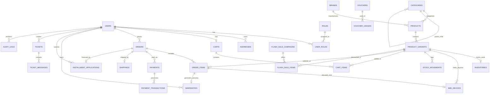
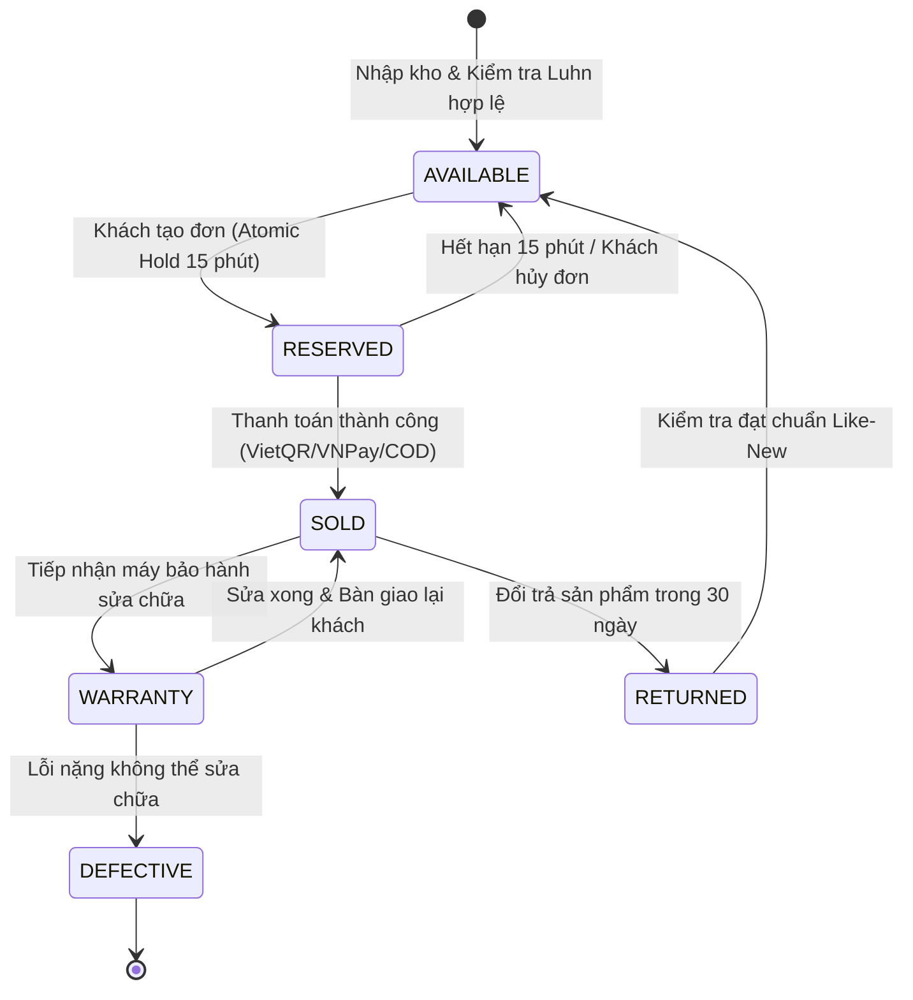
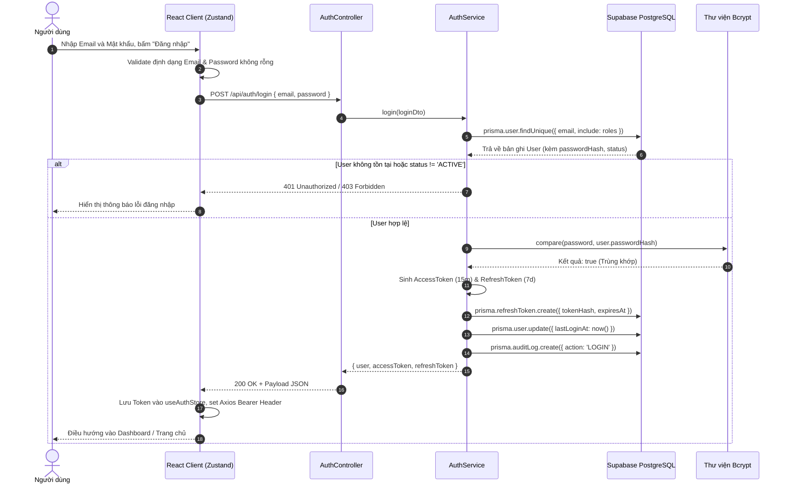
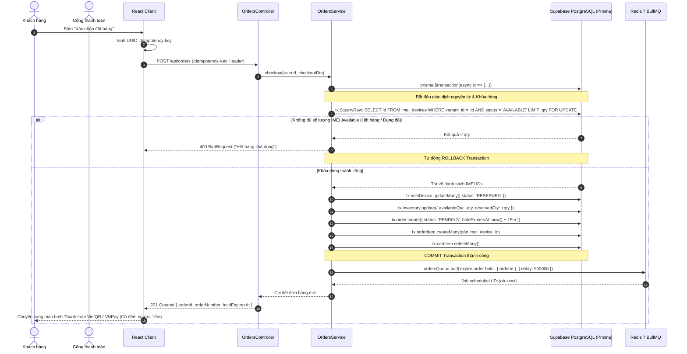
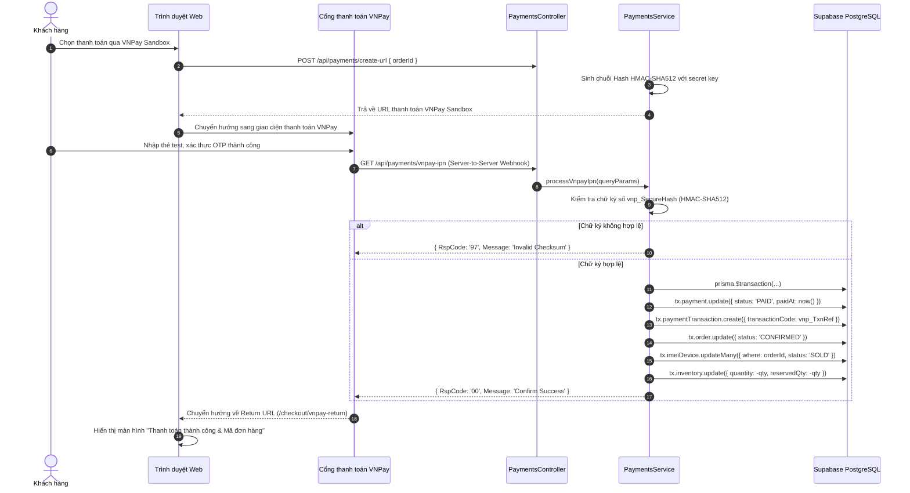
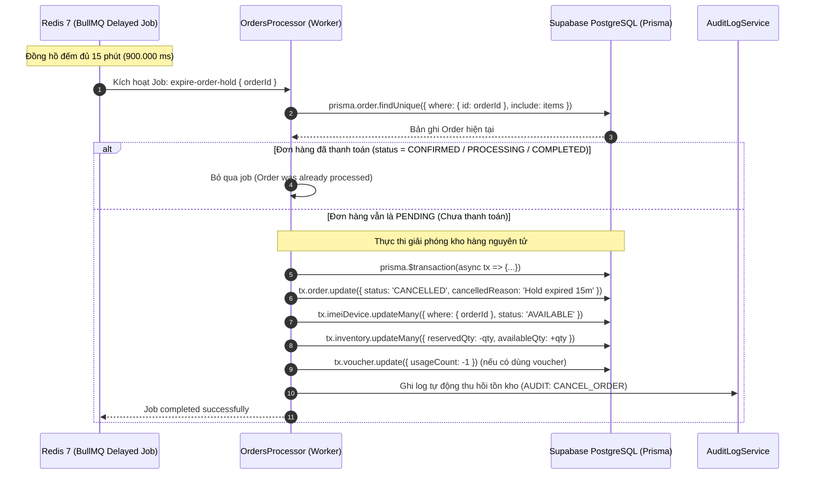
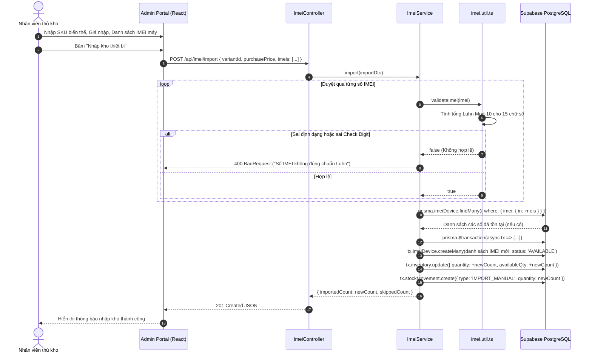
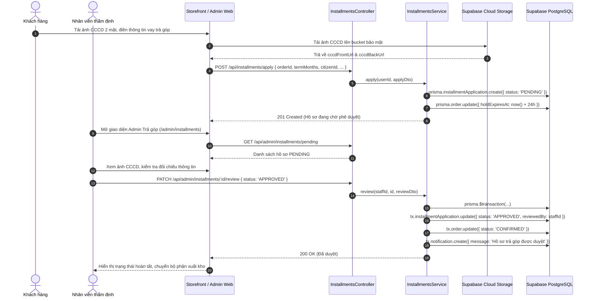
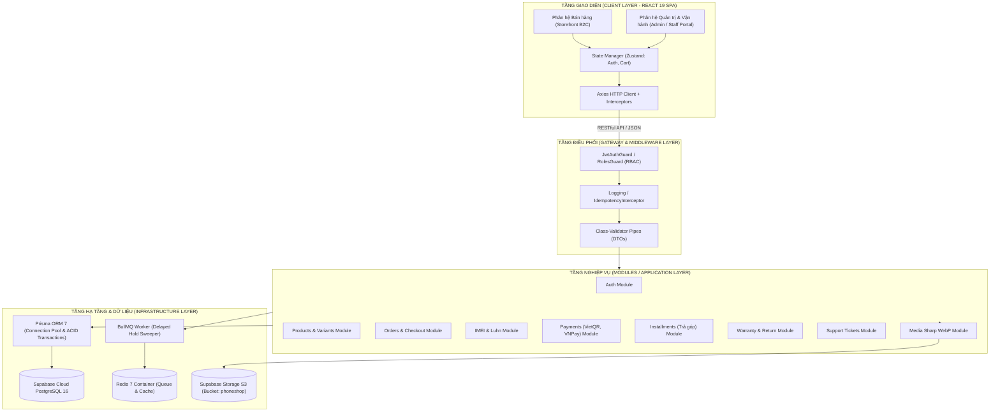

# BỘ GIÁO DỤC VÀ ĐÀO TẠO
# TRƯỜNG ĐẠI HỌC CÔNG NGHỆ KỸ THUẬT TP.HCM
## KHOA CÔNG NGHỆ THÔNG TIN
### BỘ MÔN CÔNG NGHỆ PHẦN MỀM

---

<br/>

# BÁO CÁO ĐỒ ÁN CUỐI KỲ
## ĐỀ TÀI: XÂY DỰNG HỆ THỐNG THƯƠNG MẠI ĐIỆN TỬ CHUYÊN BIỆT THIẾT BỊ DI ĐỘNG & PHỤ KIỆN CAO CẤP (PHONE SHOP)

<br/>

**MÃ MÔN HỌC:** 261SOEN330679_09  
**HỌC KỲ:** 1 – ĐỢT 1 - NĂM HỌC 2026-2027  
**GIẢNG VIÊN HƯỚNG DẪN:** TS. Hoàng Công Trình  
**NHÓM THỰC HIỆN:** Nhóm 8  

<br/>

---

### DANH SÁCH THÀNH VIÊN VÀ MỨC ĐỘ HOÀN THÀNH

| STT | Họ và Tên | Mã số sinh viên (MSSV) | Vai trò / Nhiệm vụ chính | Mức độ hoàn thành |
| :---: | :--- | :---: | :--- | :---: |
| 1 | **Lê Bá Tâm** | 24110055 | Kiến trúc Backend, Quản lý Vòng đời IMEI & Concurrency | 100% |
| 2 | **Lê Đàm Nguyên** | 24110040 | Thiết kế CSDL Supabase PostgreSQL, Prisma ORM, Storage | 100% |
| 3 | **Phan Thế Quân** | 24110050 | Phát triển Frontend Storefront (React 19, PDP, Checkout) | 100% |
| 4 | **Nguyễn Võ Mạnh Tiến** | 24110060 | Phát triển Admin Portal, Thẩm định Trả góp & Customer 360 | 100% |
| 5 | **Nguyễn Nguyên** | 24110289 | Cổng thanh toán (VietQR, VNPay), Hàng đợi Redis BullMQ, QA | 100% |

---

### NHẬN XÉT CỦA GIẢNG VIÊN HƯỚNG DẪN

...................................................................................................................................................  
...................................................................................................................................................  
...................................................................................................................................................  
...................................................................................................................................................  
...................................................................................................................................................  
...................................................................................................................................................  

**Điểm đánh giá:** .................... / 10.0  
*Tp. Hồ Chí Minh, ngày ...... tháng ...... năm 2026*  
**Chữ ký của Giảng viên hướng dẫn**  
*(Ký và ghi rõ họ tên)*  

<br/>

---

## MỤC LỤC

- [CHƯƠNG 1: GIỚI THIỆU CHUNG](#chương-1-giới-thiệu-chung)
  - [1.1 Tổng quan đề tài](#11-tổng-quan-đề-tài)
    - [1.1.1 Lý do chọn đề tài](#111-lý-do-chọn-đề-tài)
    - [1.1.2 Mục tiêu của hệ thống](#112-mục-tiêu-của-hệ-thống)
    - [1.1.3 Phạm vi đề tài](#113-phạm-vi-đề-tài)
- [CHƯƠNG 2: PHÂN TÍCH VÀ ĐẶC TẢ YÊU CẦU](#chương-2-phân-tích-và-đặc-tả-yêu-cầu)
  - [2.1 Khảo sát hiện trạng nghiệp vụ](#21-khảo-sát-hiện-trạng-nghiệp-vụ)
  - [2.2 Xác định yêu cầu hệ thống](#22-xác-định-yêu-cầu-hệ-thống)
    - [2.2.1 Yêu cầu chức năng (Functional Requirements)](#221-yêu-cầu-chức-năng-functional-requirements)
    - [2.2.2 Yêu cầu phi chức năng (Non-Functional Requirements)](#222-yêu-cầu-phi-chức-năng-non-functional-requirements)
  - [2.3 Sơ đồ Use-Case tổng quát và chi tiết các tác nhân](#23-sơ-đồ-use-case-tổng-quát-và-chi-tiết-các-tác-nhân)
  - [2.4 Đặc tả các ca sử dụng (Use-Case Specifications) cốt lõi](#24-đặc-tả-các-ca-sử-dụng-use-case-specifications-cốt-lõi)
    - [2.4.1 Đặc tả Use-Case: Đăng nhập & Xác thực hệ thống (UC-01)](#241-đặc-tả-use-case-đăng-nhập--xác-thực-hệ-thống-uc-01)
    - [2.4.2 Đặc tả Use-Case: Đặt hàng và Khóa giữ IMEI nguyên tử 15 phút (UC-02)](#242-đặc-tả-use-case-đặt-hàng-và-khóa-giữ-imei-nguyên-tử-15-phút-uc-02)
    - [2.4.3 Đặc tả Use-Case: Nhập kho & Kiểm định vòng đời Serial/IMEI (UC-03)](#243-đặc-tả-use-case-nhập-kho--kiểm-định-vòng-đời-serialimei-uc-03)
    - [2.4.4 Đặc tả Use-Case: Đăng ký & Thẩm định hồ sơ mua hàng trả góp (UC-04)](#244-đặc-tả-use-case-đăng-ký--thẩm-định-hồ-sơ-mua-hàng-trả-góp-uc-04)
    - [2.4.5 Đặc tả Use-Case: Tra cứu & Kích hoạt bảo hành điện tử E-Warranty (UC-05)](#245-đặc-tả-use-case-tra-cứu--kích-hoạt-bảo-hành-điện-tử-e-warranty-uc-05)
- [CHƯƠNG 3: THIẾT KẾ HỆ THỐNG](#chương-3-thiết-kế-hệ-thống)
  - [3.1 Thiết kế cơ sở dữ liệu](#31-thiết-kế-cơ-sở-dữ-liệu)
    - [3.1.1 Sơ đồ thực thể kết hợp (ERD)](#311-sơ-đồ-thực-thể-kết-hợp-erd)
    - [3.1.2 Mô hình quan hệ dữ liệu chuẩn hóa (3NF)](#312-mô-hình-quan-hệ-dữ-liệu-chuẩn-hóa-3nf)
    - [3.1.3 Đặc tả chi tiết các bảng dữ liệu cốt lõi](#313-đặc-tả-chi-tiết-các-bảng-dữ-liệu-cốt-lõi)
  - [3.2 Sơ đồ thiết kế cho các chức năng cốt lõi](#32-sơ-đồ-thiết-kế-cho-các-chức-năng-cốt-lõi)
    - [3.2.1 Mô tả quy trình nghiệp vụ các chức năng chính](#321-mô-tả-quy-trình-nghiệp-vụ-các-chức-năng-chính)
    - [3.2.2 Biểu đồ tuần tự (Sequence Diagrams)](#322-biểu-đồ-tuần-tự-sequence-diagrams)
- [CHƯƠNG 4: HIỆN THỰC HÓA HỆ THỐNG (LẬP TRÌNH)](#chương-4-hiện-thực-hóa-hệ-thống-lập-trình)
  - [4.1 Giới thiệu ngăn xếp công nghệ sử dụng](#41-giới-thiệu-ngăn-xếp-công-nghệ-sử-dụng)
  - [4.2 Kiến trúc hệ thống và tổ chức mã nguồn](#42-kiến-trúc-hệ-thống-và-tổ-chức-mã-nguồn)
  - [4.3 Các giải pháp kỹ thuật chuyên sâu đã hiện thực](#43-các-giải-pháp-kỹ-thuật-chuyên-sâu-đã-hiện-thực)
    - [4.3.1 Cơ chế chống Race Condition trong Flash Sale bằng Pessimistic Row-Level Locking](#431-cơ-chế-chống-race-condition-trong-flash-sale-bằng-pessimistic-row-level-locking)
    - [4.3.2 Hàng đợi Redis BullMQ và Worker giải phóng kho hàng tự động sau 15 phút](#432-hàng-đợi-redis-bullmq-và-worker-giải-phóng-kho-hàng-tự-động-sau-15-phút)
    - [4.3.3 Bộ lọc Idempotency Interceptor chống lặp giao dịch thanh toán](#433-bộ-lọc-idempotency-interceptor-chống-lặp-giao-dịch-thanh-toán)
    - [4.3.4 Pipeline xử lý và tối ưu hóa ảnh tự động sang WebP với Sharp](#434-pipeline-xử-lý-và-tối-ưu-hóa-ảnh-tự-động-sang-webp-với-sharp)
    - [4.3.5 Thuật toán kiểm tra tính hợp lệ số Serial/IMEI theo chuẩn Luhn Mod-10](#435-thuật-toán-kiểm-tra-tính-hợp-lệ-số-serialimei-theo-chuẩn-luhn-mod-10)
  - [4.4 Giao diện các màn hình chính của ứng dụng](#44-giao-diện-các-màn-hình-chính-của-ứng-dụng)
- [CHƯƠNG 5: KIỂM THỬ (TESTING)](#chương-5-kiểm-thử-testing)
  - [5.1 Phương pháp và chiến lược kiểm thử](#51-phương-pháp-và-chiến-lược-kiểm-thử)
  - [5.2 Bảng tổng hợp kịch bản kiểm thử chức năng (Test Cases)](#52-bảng-tổng-hợp-kịch-bản-kiểm-thử-chức-năng-test-cases)
  - [5.3 Kiểm thử đơn vị tự động (Automated Unit Testing) với Jest](#53-kiểm-thử-đơn-vị-tự-động-automated-unit-testing-với-jest)
- [CHƯƠNG 6: TỔNG KẾT VÀ HƯỚNG PHÁT TRIỂN](#chương-6-tổng-kết-và-hướng-phát-triển)
  - [6.1 Đánh giá ưu điểm và hạn chế của hệ thống](#61-đánh-giá-ưu-điểm-và-hạn-chế-của-hệ-thống)
  - [6.2 Hướng phát triển và mở rộng trong tương lai](#62-hướng-phát-triển-và-mở-rộng-trong-tương-lai)
- [TÀI LIỆU THAM KHẢO](#tài-liệu-tham-khảo)

---

## DANH SÁCH BẢNG

- **Bảng 2.1:** Danh mục yêu cầu chức năng của hệ thống (Functional Requirements)
- **Bảng 2.2:** Danh mục yêu cầu phi chức năng của hệ thống (Non-Functional Requirements)
- **Bảng 2.3:** Đặc tả chi tiết Use-Case: Đăng nhập & Xác thực hệ thống (UC-01)
- **Bảng 2.4:** Đặc tả chi tiết Use-Case: Đặt hàng & Khóa giữ IMEI nguyên tử 15 phút (UC-02)
- **Bảng 2.5:** Đặc tả chi tiết Use-Case: Nhập kho & Kiểm định vòng đời Serial/IMEI (UC-03)
- **Bảng 2.6:** Đặc tả chi tiết Use-Case: Đăng ký & Thẩm định duyệt hồ sơ trả góp 0% (UC-04)
- **Bảng 2.7:** Đặc tả chi tiết Use-Case: Tra cứu & Kích hoạt bảo hành điện tử (UC-05)
- **Bảng 3.1:** Cấu trúc bảng `users` (Tài khoản người dùng hệ thống)
- **Bảng 3.2:** Cấu trúc bảng `roles` và `user_roles` (Phân quyền RBAC)
- **Bảng 3.3:** Cấu trúc bảng `brands` và `categories` (Thương hiệu & Danh mục đa cấp)
- **Bảng 3.4:** Cấu trúc bảng `products` (Sản phẩm kinh doanh)
- **Bảng 3.5:** Cấu trúc bảng `product_variants` (Biến thể cấu hình & Màu sắc)
- **Bảng 3.6:** Cấu trúc bảng `inventories` (Số lượng tồn kho và giữ chỗ)
- **Bảng 3.7:** Cấu trúc bảng `imei_devices` (Thiết bị định danh Serial/IMEI vật lý)
- **Bảng 3.8:** Cấu trúc bảng `orders` (Đơn đặt hàng)
- **Bảng 3.9:** Cấu trúc bảng `order_items` (Chi tiết dòng sản phẩm và IMEI gán)
- **Bảng 3.10:** Cấu trúc bảng `payments` và `payment_transactions` (Thanh toán & Giao dịch)
- **Bảng 3.11:** Cấu trúc bảng `shippings` (Vận chuyển và Mã vận đơn)
- **Bảng 3.12:** Cấu trúc bảng `vouchers` (Mã khuyến mãi & Ràng buộc)
- **Bảng 3.13:** Cấu trúc bảng `installment_applications` (Hồ sơ đăng ký trả góp tài chính)
- **Bảng 3.14:** Cấu trúc bảng `warranties` (Phiếu bảo hành điện tử)
- **Bảng 3.15:** Cấu trúc bảng `audit_logs` (Nhật ký kiểm toán hệ thống)
- **Bảng 4.1:** Bảng tổng hợp ngăn xếp công nghệ (Technology Stack)
- **Bảng 5.1:** Bảng tổng hợp các kịch bản kiểm thử hệ thống (Test Cases)
- **Bảng 5.2:** Bảng tổng hợp kết quả thực thi các bộ kiểm thử tự động (Unit Test Suites)
- **Bảng 6.1:** Bảng đánh giá tổng kết phần mềm sau khi hoàn thiện

---

## DANH SÁCH HÌNH VẼ & SƠ ĐỒ

- **Sơ đồ 2.1:** Sơ đồ Use-Case tổng quát hệ thống Phone Shop
- **Sơ đồ 3.1:** Sơ đồ mối quan hệ thực thể (ERD) cơ sở dữ liệu Phone Shop
- **Sơ đồ 3.2:** Vòng đời máy trạng thái định danh IMEI thiết bị di động
- **Sơ đồ 3.3:** Sơ đồ kiến trúc tổng thể Modular Monolith & Clean Architecture
- **Sơ đồ 3.4:** Biểu đồ tuần tự: Xác thực đăng nhập & Cấp phát JWT / Refresh Token
- **Sơ đồ 3.5:** Biểu đồ tuần tự: Đặt hàng nguyên tử & Khóa giữ IMEI 15 phút với Redis BullMQ
- **Sơ đồ 3.6:** Biểu đồ tuần tự: Thanh toán VNPay Sandbox & Webhook IPN kích hoạt máy
- **Sơ đồ 3.7:** Biểu đồ tuần tự: Delayed BullMQ Worker tự động giải phóng giữ hàng sau 15 phút
- **Sơ đồ 3.8:** Biểu đồ tuần tự: Nhập kho IMEI và kiểm định thuật toán Luhn
- **Sơ đồ 3.9:** Biểu đồ tuần tự: Nộp hồ sơ và Thẩm định trả góp 0% qua CCCD
- **Hình 4.1:** Giao diện Đăng nhập, Đăng ký và Quên mật khẩu
- **Hình 4.2:** Giao diện Trang chủ Storefront (Hero Banner, Brand Showcase, Flash Sale)
- **Hình 4.3:** Giao diện Danh mục sản phẩm & Bộ lọc đa tiêu chí (RAM, ROM, Giá, 5G, Chipset)
- **Hình 4.4:** Giao diện Chi tiết sản phẩm (PDP - Dynamic Variant Selector, Specs Matrix, Modal Trả góp)
- **Hình 4.5:** Giao diện Giỏ hàng thông minh (Slide-out CartDrawer, Selective Checkout)
- **Hình 4.6:** Giao diện Đặt hàng & Thanh toán (VietQR tự động, VNPay, Hồ sơ trả góp)
- **Hình 4.7:** Giao diện Tra cứu Bảo hành điện tử (E-Warranty Lookup theo IMEI)
- **Hình 4.8:** Giao diện Bảng điều khiển Quản trị (Admin Dashboard & KPI Cards)
- **Hình 4.9:** Giao diện Quản lý Sản phẩm, Biến thể & Tải ảnh nén WebP
- **Hình 4.10:** Giao diện Quản lý kho Serial/IMEI & Kiểm tra thuật toán Luhn
- **Hình 4.11:** Giao diện Quản lý Đơn hàng & Vận chuyển (Fulfillment & Shipping)
- **Hình 4.12:** Giao diện Thẩm định hồ sơ Trả góp tài chính (CCCD gắn chip & Duyệt hạn mức)
- **Hình 4.13:** Giao diện Khách hàng 360 độ (Customer 360) & Hỗ trợ Ticket đa kênh

---

# CHƯƠNG 1: GIỚI THIỆU CHUNG

## 1.1 Tổng quan đề tài

### 1.1.1 Lý do chọn đề tài
Trong thập kỷ chuyển đổi số hiện nay, thị trường thiết bị di động thông minh (Smartphones, Tablets, Wearables) tại Việt Nam và trên toàn cầu không ngừng tăng trưởng vượt bậc với giá trị giao dịch lên tới hàng tỷ USD. Khác biệt cơ bản so với các ngành hàng thời trang, tiêu dùng nhanh hay nhu yếu phẩm thông thường, kinh doanh bán lẻ thiết bị di động sở hữu **những bài toán kỹ thuật đặc thù và vô cùng phức tạp**:
1. **Mỗi chiếc điện thoại là một thực thể vật lý duy nhất:** Một chiếc iPhone hay Samsung Galaxy không thể chỉ quản lý bằng con số số lượng tồn kho chung chung (`quantity`). Mỗi thiết bị xuất xưởng đều gắn liền với một dãy số **Serial/IMEI (International Mobile Equipment Identity)** chuẩn 15 chữ số tuân thủ thuật toán kiểm tra Luhn (Mod-10). Việc nhầm lẫn hay thất thoát dù chỉ một số IMEI sẽ kéo theo hàng loạt sai lệch nghiêm trọng trong khâu phân phối, xuất hóa đơn tài chính và bảo hành sau bán hàng.
2. **Khủng hoảng tranh chấp đồng thời (Race Condition) trong các đợt mở bán Flagship / Flash Sale:** Khi các dòng sản phẩm cao cấp (như iPhone thế hệ mới, Galaxy Ultra, Xiaomi Pro) chính thức mở bán với số lượng giới hạn, hàng trăm hoặc hàng ngàn người dùng có thể cùng nhấn nút "Đặt hàng" trong cùng một giây. Nếu hệ thống chỉ áp dụng các câu lệnh kiểm tra và trừ tồn kho đơn giản mà không có cơ chế khóa mức dòng (Pessimistic Locking), hiện tượng bán khống (Overselling) sẽ lập tức xảy ra: hai hay nhiều khách hàng cùng thanh toán thành công một chiếc điện thoại duy nhất, gây tổn hại nghiêm trọng đến uy tín thương hiệu.
3. **Bài toán chiếm dụng tồn kho và tự động giải phóng (Atomic Hold & Expire):** Khi khách hàng chọn sản phẩm và chuyển sang cổng thanh toán trực tuyến (VNPay, VietQR), cửa hàng phải tạm giữ (HOLD) chiếc máy cụ thể đó cho khách hàng. Tuy nhiên, nếu khách hàng đóng trình duyệt, mất mạng hoặc đổi ý không thanh toán, nếu không có cơ chế tự động hủy và giải phóng tồn kho chính xác theo thời gian thực (sau 15 phút), lượng hàng trong kho sẽ bị đóng băng giả tạo (Ghost Inventory), tước đoạt cơ hội mua hàng của những khách hàng khác.
4. **Quy trình thẩm định mua hàng trả góp tài chính (Installment 0%):** Đối với các thiết bị cao cấp có giá trị từ 15 đến 40 triệu đồng, hơn 40% người tiêu dùng lựa chọn hình thức trả góp qua công ty tài chính (Home Credit, FE Credit). Việc số hóa toàn bộ quy trình: chọn gói trả trước, tải ảnh Căn cước công dân (CCCD) gắn chip, thẩm định thông tin và phê duyệt khoản vay ngay trên hệ thống là một yêu cầu cấp thiết.
5. **Số hóa quy trình hậu mãi - Bảo hành điện tử (E-Warranty):** Khách hàng hiện đại không còn muốn lưu giữ các phiếu bảo hành bằng giấy dễ rách nát hoặc thất lạc. Một hệ thống cho phép khách hàng tra cứu tức thời nguồn gốc xuất xứ, thời hạn bảo hành chính hãng và lịch sử sửa chữa chỉ bằng dãy số IMEI là tiêu chuẩn dịch vụ bắt buộc.

Xuất phát từ những trăn trở nghiệp vụ và thách thức công nghệ trên, nhóm nghiên cứu đã lựa chọn và phát triển đề tài: **"Xây dựng hệ thống thương mại điện tử chuyên biệt thiết bị di động & phụ kiện cao cấp (Phone Shop)"**. Đề tài không chỉ dừng lại ở các bài toán CRUD thương mại điện tử cơ bản mà đi sâu giải quyết trọn vẹn các thách thức kỹ thuật cấp độ doanh nghiệp: kiểm soát giao dịch nguyên tử, cơ chế chống Race Condition, hàng đợi xử lý nền Redis BullMQ, lưu trữ đám mây Supabase PostgreSQL, tối ưu hóa ảnh Sharp WebP và giao diện trải nghiệm người dùng Clean Light Mode (Apple Pavilion & Swiss Minimalist).

### 1.1.2 Mục tiêu của hệ thống
Hệ thống được thiết kế và xây dựng nhằm hiện thực hóa các mục tiêu cốt lõi sau:
- **Đối với khách hàng cá nhân (Storefront B2C):** Cung cấp không gian trải nghiệm mua sắm hiện đại, tinh tế với tốc độ tải trang cực nhanh; hỗ trợ bộ lọc thông số kỹ thuật phần cứng chuyên sâu (Chipset, RAM, ROM, 5G, màn hình); cơ chế chọn biến thể màu sắc/dung lượng mượt mà theo thời gian thực; đa dạng hình thức thanh toán (COD, VietQR NAPAS 247 động, VNPay Sandbox, Trả góp 0%); tra cứu bảo hành điện tử công khai và hệ thống hỗ trợ Ticket đa kênh.
- **Đối với nhân viên vận hành và kho (Staff Portal):** Tối ưu hóa năng suất xử lý đơn hàng; nhập kho thiết bị tự động kiểm tra định dạng IMEI bằng thuật toán Luhn; theo dõi trực quan vị trí và trạng thái máy (`AVAILABLE`, `HOLD`, `SOLD`, `WARRANTY`, `DEFECTIVE`); thẩm định nhanh hồ sơ trả góp CCCD; tiếp nhận và phân loại ticket khiếu nại của khách hàng.
- **Đối với nhà quản trị kinh doanh (Admin Portal):** Cung cấp bức tranh toàn cảnh về hoạt động kinh doanh thông qua Admin Dashboard thời gian thực; quản lý danh mục sản phẩm đa cấp; thiết lập chiến dịch Flash Sale đếm ngược; cấu hình mã giảm giá (Voucher) với đa tầng ràng buộc; quản lý hồ sơ khách hàng 360 độ (Customer 360) và kiểm soát an ninh thông qua nhật ký kiểm toán hệ thống (Audit Log).
- **Mục tiêu học thuật môn Công nghệ phần mềm:** Vận dụng triệt để phương pháp luận phát triển phần mềm hiện đại; tuân thủ kiến trúc phân tầng **Modular Monolith & Clean Architecture**; hiện thực hóa các mẫu thiết kế hướng đối tượng (OOAD); thiết kế cơ sở dữ liệu quan hệ chuẩn hóa 3NF; viết kiểm thử đơn vị tự động (Unit Test Suites với Jest) và áp dụng cơ chế phân quyền bảo mật RBAC (Role-Based Access Control) chuẩn công nghiệp.

### 1.1.3 Phạm vi đề tài
- **Mô hình nghiệp vụ:** Tập trung chuyên biệt vào mô hình B2C (Business-to-Consumer) cho ngành bán lẻ thiết bị di động và phụ kiện chính hãng.
- **Phân hệ người dùng:** 
  1. *Phân hệ Khách hàng (Storefront):* Dành cho khách vãng lai và thành viên mua sắm trực tuyến.
  2. *Phân hệ Vận hành (Staff Portal):* Dành cho nhân viên bán hàng, thủ kho và nhân viên hỗ trợ khách hàng.
  3. *Phân hệ Quản trị (Admin Portal):* Dành cho cấp quản lý điều hành toàn bộ hệ sinh thái dữ liệu, người dùng, tài chính và cấu hình hệ thống.
- **Dữ liệu thực tế của hệ thống:** Toàn bộ danh mục gồm 60 smartphone flagship và cận cao cấp từ các thương hiệu hàng đầu (Apple, Samsung, Xiaomi, OPPO, Sony, ASUS ROG, Vivo, Google Pixel) với hơn 127 biến thể màu sắc/dung lượng/RAM thực tế, thông số phần cứng chi tiết, giá bán niêm yết VND chính xác và hình ảnh thực tế được tối ưu hóa.
- **Giới hạn đề tài:** Hệ thống không can thiệp vào quy trình giao nhận thực tế ngoài đời thực của shipper mà tích hợp mô phỏng quy trình logistics; cổng thanh toán VNPay và tổ chức tài chính trả góp hoạt động trên môi trường Sandbox tích hợp API đạt chuẩn nghiệp vụ thực tế.

---

# CHƯƠNG 2: PHÂN TÍCH VÀ ĐẶC TẢ YÊU CẦU

## 2.1 Khảo sát hiện trạng nghiệp vụ
Khảo sát thực tiễn tại các chuỗi cửa hàng bán lẻ điện thoại và đại lý ủy quyền vừa và nhỏ cho thấy các bất cập nghiêm trọng trong quy trình vận hành truyền thống:
- **Quản lý tồn kho theo số lượng đơn thuần:** Khi nhân viên bán một chiếc điện thoại, phần mềm cũ chỉ trừ `-1` vào số lượng tổng mà không lưu vết chiếc máy có số IMEI nào đã được giao cho khách. Hậu quả là khi khách hàng mang máy đến bảo hành, cửa hàng không thể xác minh chiếc máy đó có đúng xuất xứ từ cửa hàng hay không.
- **Tranh chấp dữ liệu trong các sự kiện mở bán:** Do cơ sở dữ liệu không có cơ chế khóa dòng nguyên tử, khi diễn ra các đợt giảm giá chớp nhoáng (Flash Sale), các yêu cầu gửi lên đồng thời gây ra tình trạng đọc dữ liệu cũ (Dirty Read) dẫn đến việc bán vượt quá số lượng hàng có trong kho.
- **Nghẽn kho ảo do đơn hàng treo (Ghost Holds):** Khách hàng đặt đơn chọn phương thức chuyển khoản nhưng không thực hiện thanh toán. Nhân viên không biết khi nào nên hủy đơn để bán cho người khác, dẫn đến tình trạng máy nằm chết trong kho hàng tuần liền.
- **Bảo hành thủ công và rủi ro gian lận:** Việc sử dụng sổ bảo hành giấy hoặc tem dán trên thân máy rất dễ bị làm giả, bong tróc hoặc người dùng làm mất, gây tranh chấp gay gắt giữa khách hàng và bộ phận chăm sóc khách hàng.
- **Xét duyệt trả góp rườm rà:** Khách hàng phải phô tô CCCD mang ra cửa hàng, nhân viên nhập liệu thủ công vào bảng tính Excel gửi qua Zalo cho đối tác tài chính, thời gian chờ đợi kéo dài từ 2 đến 3 ngày làm giảm tỷ lệ chốt đơn thành công.

Từ đó, việc xây dựng một hệ sinh thái thương mại điện tử chuyên biệt, tích hợp kiểm soát IMEI, khóa hàng nguyên tử 15 phút bằng Redis BullMQ, tra cứu bảo hành điện tử tức thì và thẩm định trả góp trực tuyến là giải pháp công nghệ mang tính sống còn.

## 2.2 Xác định yêu cầu hệ thống

### 2.2.1 Yêu cầu chức năng (Functional Requirements)

| Nhóm chức năng | Mã FR | Tên chức năng | Mô tả chi tiết nghiệp vụ | Tác nhân thực hiện |
| :--- | :---: | :--- | :--- | :--- |
| **Xác thực & Tài khoản** | FR-01 | Đăng ký & Đăng nhập | Đăng ký tài khoản, đăng nhập cấp JWT Access/Refresh Token, đăng nhập Google OAuth, phân quyền RBAC 3 vai trò (`ADMIN`, `STAFF`, `USER`). | Khách vãng lai, Thành viên |
| | FR-02 | Quên & Đặt lại mật khẩu | Gửi mã token xác thực an toàn qua email, hỗ trợ người dùng tự thiết lập lại mật khẩu mới khi quên. | Khách hàng |
| | FR-03 | Quản lý sổ địa chỉ | Lưu trữ nhiều địa chỉ nhận hàng (Nhà riêng, Văn phòng), thiết lập địa chỉ mặc định, tự động điền khi thanh toán. | Khách hàng |
| **Catalog & Tìm kiếm** | FR-04 | Tìm kiếm & Lọc phần cứng | Tìm kiếm thời gian thực theo tên, lọc đa tiêu chí: Hãng, tầm giá, RAM, bộ nhớ ROM, công nghệ mạng 5G, hệ điều hành. | Mọi đối tượng |
| | FR-05 | Chi tiết sản phẩm & Biến thể | Hiển thị ma trận thông số kỹ thuật phần cứng, chuyển đổi linh hoạt phiên bản màu sắc/dung lượng kèm giá và ảnh tương ứng. | Mọi đối tượng |
| | FR-06 | Danh sách yêu thích & So sánh | Thêm/xóa sản phẩm vào Wishlist cá nhân; so sánh đối đầu thông số kỹ thuật giữa 2 thiết bị smartphone. | Khách hàng |
| **Giỏ hàng & Đặt hàng** | FR-07 | Giỏ hàng & Chọn lọc mặt hàng | Thêm sản phẩm vào giỏ, tăng giảm số lượng, chọn lọc từng món cần mua (Selective Checkout), xóa hàng loạt mặt hàng đã chọn. | Khách hàng |
| | FR-08 | Áp dụng Voucher & Flash Sale | Áp dụng mã giảm giá (theo % hoặc số tiền cố định), kiểm tra giá trị đơn tối thiểu, mức giảm tối đa và khung giờ Flash Sale. | Khách hàng |
| | FR-09 | Đặt hàng & Khóa giữ IMEI 15m | Khởi tạo đơn hàng nguyên tử, khóa giữ đúng mã IMEI vật lý trong 15 phút, kích hoạt đồng hồ đếm ngược giữ hàng. | Khách hàng, Hệ thống |
| | FR-10 | Tự động hủy giữ hàng 15m | Sử dụng hàng đợi Redis BullMQ, tự động hoàn trả IMEI về `AVAILABLE` và cập nhật đơn sang `CANCELLED` nếu quá 15 phút chưa thanh toán. | Hệ thống (BullMQ Worker) |
| **Thanh toán & Vận chuyển** | FR-11 | Thanh toán VietQR & VNPay | Sinh mã VietQR chuẩn NAPAS 247 động; tích hợp cổng VNPay Sandbox với chữ ký số HMAC-SHA512 và xác thực Webhook IPN. | Khách hàng, Cổng thanh toán |
| | FR-12 | Đăng ký mua trả góp 0% | Chọn gói trả góp tài chính (Home Credit, FE Credit), tính toán số tiền trả trước và hàng tháng, tải ảnh CCCD 2 mặt để thẩm định. | Khách hàng |
| | FR-13 | Quản lý vận chuyển đa phương thức | Hỗ trợ các gói giao hàng: Tiết kiệm (Economy), Tiêu chuẩn (Standard), Giao hỏa tốc 2 giờ (Express 2H); tích hợp mã vận đơn tracking. | Khách hàng, Nhân viên |
| **Hậu mãi & Hỗ trợ** | FR-14 | Tra cứu Bảo hành điện tử | Khách hàng nhập số IMEI/Serial để tra cứu trực tuyến ngày kích hoạt, thời hạn bảo hành chính hãng và lịch sử sửa chữa. | Mọi đối tượng |
| | FR-15 | Đánh giá & Phản hồi hình ảnh | Khách đã mua hàng được gửi đánh giá số sao (1-5 sao) kèm hình ảnh thực tế; Nhân viên/Admin gửi phản hồi chính thức. | Khách hàng, Nhân viên |
| | FR-16 | Quản lý Ticket hỗ trợ đa kênh | Khách hàng tạo ticket yêu cầu bảo hành/đổi trả/tư vấn; Nhân viên tiếp nhận, phân loại và trao đổi tin nhắn trực tiếp qua ticket. | Khách hàng, Nhân viên |
| **Quản trị & Vận hành** | FR-17 | Bảng điều khiển kinh doanh | Thống kê KPI tổng doanh thu, số lượng đơn hàng, lượng khách hàng mới, cảnh báo tồn kho thấp và biểu đồ doanh số. | Admin, Nhân viên |
| | FR-18 | Quản lý Sản phẩm & Biến thể | Thêm, sửa, xóa sản phẩm, cấu hình biến thể (RAM/ROM/Màu), tự động nén và chuyển đổi ảnh sang chuẩn WebP bằng Sharp. | Admin, Nhân viên |
| | FR-19 | Quản lý kho Serial/IMEI | Nhập kho danh sách IMEI theo từng biến thể, kiểm tra thuật toán Luhn Mod-10, quản lý vòng đời trạng thái thiết bị. | Admin, Thủ kho (Staff) |
| | FR-20 | Thẩm định hồ sơ Trả góp | Kiểm duyệt hồ sơ vay trả góp, xem ảnh CCCD, xác minh thu nhập, duyệt hồ sơ để cho phép xuất kho hoặc từ chối kèm lý do. | Nhân viên thẩm định |
| | FR-21 | Khách hàng 360 & Khóa tài khoản | Xem tổng quan hồ sơ khách hàng, tổng chi tiêu, lịch sử đơn hàng, ticket hỗ trợ; thực hiện khóa/mở khóa tài khoản vi phạm. | Admin, Nhân viên |
| | FR-22 | Nhật ký kiểm toán (Audit Log) | Ghi nhận chi tiết mọi hành vi thêm, sửa, xóa nhạy cảm trên hệ thống (Sản phẩm, Đơn hàng, Phân quyền, Tồn kho) kèm IP và User-Agent. | Admin |

*Bảng 2.1: Danh mục yêu cầu chức năng của hệ thống (Functional Requirements)*

---

### 2.2.2 Yêu cầu phi chức năng (Non-Functional Requirements)

| Tiêu chí | Mã NFR | Đặc tả yêu cầu kỹ thuật chi tiết | Phương pháp đo lường & Tiêu chuẩn đạt |
| :--- | :---: | :--- | :--- |
| **Hiệu năng (Performance)** | NFR-01 | Tốc độ phản hồi của API với các truy vấn đọc danh mục, trang chủ và chi tiết sản phẩm phải cực nhanh. Tối ưu hóa truy vấn qua chỉ mục CSDL (B-Tree Indexing) và nén phản hồi JSON. | P95 Response Time < 250ms trên máy chủ tiêu chuẩn; điểm Google Lighthouse trang Storefront đạt >= 90. |
| **Chống tranh chấp (Concurrency)** | NFR-02 | Đảm bảo tính nhất quán tuyệt đối trong các sự kiện mở bán Flash Sale. Ngăn chặn triệt để hiện tượng Race Condition và bán khống thiết bị (Overselling). | Sử dụng cơ chế khóa dòng bi quan (Pessimistic Row-level Locking: `SELECT ... FOR UPDATE`) trong giao dịch nguyên tử `prisma.$transaction`. 100 request đồng thời mua 1 máy chỉ có duy nhất 1 request thành công. |
| **Bảo mật & Phân quyền (Security & RBAC)** | NFR-03 | Toàn bộ mật khẩu người dùng phải được băm bảo mật bằng thuật toán Bcrypt với Salt Round = 10. Cơ chế xác thực phi trạng thái bằng JSON Web Token (JWT) gồm Access Token (15 phút) và Refresh Token (7 ngày) lưu an toàn trong CSDL. | Phân quyền nghiêm ngặt theo vai trò (RBAC Guard) tại tầng Controller; chặn hoàn toàn các truy cập trái phép với mã lỗi 401 Unauthorized và 403 Forbidden. |
| **Chống lặp giao dịch (Idempotency)** | NFR-04 | Các endpoint nhạy cảm (Tạo đơn hàng, Thanh toán, Xử lý Webhook IPN) phải có cơ chế ngăn chặn xử lý trùng lặp khi người dùng nhấn nút nhiều lần hoặc do lỗi mạng. | Triển khai `IdempotencyInterceptor` kiểm tra trường `Idempotency-Key` (UUID). Nếu trùng key trong 24 giờ, hệ thống trả lại kết quả giao dịch trước đó mà không xử lý lại. |
| **Tính khả dụng (Usability & Design)** | NFR-05 | Giao diện người dùng tuân theo ngôn ngữ thiết kế Clean Light Mode (Apple Pavilion & Swiss Minimalist), chú trọng kiểu chữ sắc nét, khoảng trắng thoáng đãng và hiệu ứng kính mờ (Glassmorphism). | Tương thích hoàn hảo (100% Responsive) trên mọi kích thước màn hình từ điện thoại di động (360px) đến màn hình 4K Ultra-wide. |
| **Toàn vẹn dữ liệu (Data Integrity & ACID)** | NFR-06 | Các thao tác nghiệp vụ phức tạp (Tạo đơn, Giữ IMEI, Trừ tồn kho, Áp voucher) phải được thực thi trong một Database Transaction duy nhất. | Tuân thủ 100% nguyên tắc ACID của hệ quản trị cơ sở dữ liệu PostgreSQL; tự động Rollback toàn bộ dữ liệu nếu bất kỳ bước nào trong chuỗi giao dịch phát sinh lỗi. |
| **Độ tin cậy & Sẵn sàng (Reliability)** | NFR-07 | Hệ thống có khả năng xử lý ngắt quãng kết nối Redis mà không làm sập ứng dụng Backend; tự động khởi chạy luồng quét dự phòng (In-memory Sweeper Fallback). | Mức độ sẵn sàng vận hành của hệ thống (System Uptime) đạt tối thiểu 99.5%; dữ liệu lưu trữ đám mây Supabase PostgreSQL được sao lưu tự động hàng ngày. |

*Bảng 2.2: Danh mục yêu cầu phi chức năng của hệ thống (Non-Functional Requirements)*

---

## 2.3 Sơ đồ Use-Case tổng quát và chi tiết các tác nhân

Hệ thống Phone Shop được xây dựng dựa trên sự tương tác của 5 tác nhân chính:
1. **Khách vãng lai (Guest):** Người dùng truy cập website nhưng chưa đăng nhập. Có thể tìm kiếm, lọc thông số kỹ thuật, xem chi tiết sản phẩm, xem so sánh thiết bị, tra cứu bảo hành điện tử công khai và thực hiện đăng ký tài khoản.
2. **Khách hàng thành viên (Customer / User):** Kế thừa toàn bộ quyền hạn của Khách vãng lai, được cấp quyền thực hiện các ca sử dụng cá nhân hóa: quản lý giỏ hàng có chọn lọc, áp dụng mã voucher, đặt hàng giữ máy 15 phút, thanh toán trực tuyến (VietQR, VNPay), đăng ký hồ sơ mua trả góp CCCD, theo dõi tiến trình đơn hàng, gửi đánh giá có ảnh và tạo ticket yêu cầu hỗ trợ.
3. **Nhân viên vận hành (Staff):** Người thực hiện các nghiệp vụ thường nhật: nhập kho danh sách thiết bị kiểm tra thuật toán Luhn, đóng gói đơn hàng và gán mã vận đơn giao nhận, thẩm định hồ sơ đăng ký trả góp của khách hàng, phản hồi đánh giá sản phẩm và giải quyết các ticket khiếu nại.
4. **Quản trị viên hệ thống (Admin):** Nắm giữ quyền hạn cao nhất trong hệ sinh thái: quản lý danh mục và thương hiệu, quản trị danh sách người dùng và phân quyền RBAC, thiết lập chiến dịch Flash Sale và mã Voucher, theo dõi KPI trên Dashboard điều hành và giám sát nhật ký kiểm toán hệ thống (Audit Log).
5. **Tác nhân ngoại vi & Nền tảng hệ thống:**
   - *Hệ thống hàng đợi Redis BullMQ:* Tiếp nhận và kích hoạt các Job trì hoãn 15 phút để tự động hủy đơn và giải phóng IMEI.
   - *Cổng thanh toán VNPay / Ngân hàng VietQR:* Tiếp nhận giao dịch thanh toán và gửi tín hiệu xác nhận Webhook IPN về máy chủ.
   - *Lưu trữ đám mây Supabase Cloud:* Lưu trữ cơ sở dữ liệu quan hệ PostgreSQL và cụm bucket S3 chứa hình ảnh sản phẩm.

```mermaid
flowchart TD
    subgraph Actors["CÁC TÁC NHÂN HỆ THỐNG"]
        Guest["Khách Vãng Lai (Guest)"]
        User["Khách Hàng (Customer)"]
        Staff["Nhân Viên (Staff)"]
        Admin["Quản Trị Viên (Admin)"]
        ExternalSys["Redis BullMQ / VNPay / VietQR"]
    end

    subgraph Storefront_UC["PHÂN HỆ BÁN HÀNG (STOREFRONT)"]
        UC01["UC-01: Đăng nhập & Đăng ký"]
        UC04_1["Tìm kiếm & Lọc phần cứng"]
        UC05_1["Xem PDP & Ma trận thông số"]
        UC06_1["Quản lý Giỏ hàng chọn lọc"]
        UC02["UC-02: Đặt hàng & Khóa giữ IMEI 15m"]
        UC_Pay["Thanh toán VietQR / VNPay"]
        UC04["UC-04: Đăng ký Mua trả góp CCCD"]
        UC05["UC-05: Tra cứu Bảo hành điện tử"]
        UC_Ticket["Gửi Ticket khiếu nại & Hỗ trợ"]
    end

    subgraph Operation_UC["PHÂN HỆ VẬN HÀNH & KHO (STAFF PORTAL)"]
        UC03["UC-03: Nhập kho IMEI & Kiểm tra Luhn"]
        UC_Pack["Đóng gói đơn & Gán mã vận đơn"]
        UC_ReviewInst["Thẩm định hồ sơ Trả góp"]
        UC_Support["Xử lý Ticket & Phản hồi Review"]
    end

    subgraph Admin_UC["PHÂN HỆ QUẢN TRỊ (ADMIN PORTAL)"]
        UC_Dash["Xem Dashboard KPI Doanh thu"]
        UC_Prod["Quản lý Sản phẩm & Biến thể"]
        UC_User["Quản lý Người dùng & RBAC"]
        UC_Promo["Cấu hình Flash Sale & Voucher"]
        UC_Audit["Giám sát Nhật ký Audit Log"]
    end

    Guest --> UC01
    Guest --> UC04_1
    Guest --> UC05_1
    Guest --> UC05

    User -.->|Kế thừa| Guest
    User --> UC06_1
    User --> UC02
    User --> UC_Pay
    User --> UC04
    User --> UC_Ticket

    Staff --> UC03
    Staff --> UC_Pack
    Staff --> UC_ReviewInst
    Staff --> UC_Support

    Admin -.->|Bao gồm| Staff
    Admin --> UC_Dash
    Admin --> UC_Prod
    Admin --> UC_User
    Admin --> UC_Promo
    Admin --> UC_Audit

    UC02 -.->|Lập lịch 15m| ExternalSys
    ExternalSys -.->|Hủy giữ hàng / IPN| UC02
    UC_Pay <--> ExternalSys
```



*Sơ đồ 2.1: Sơ đồ Use-Case tổng quát hệ thống Phone Shop*

---

## 2.4 Đặc tả các ca sử dụng (Use-Case Specifications) cốt lõi

### 2.4.1 Đặc tả Use-Case: Đăng nhập & Xác thực hệ thống (UC-01)

| Thuộc tính | Nội dung mô tả chi tiết |
| :--- | :--- |
| **Mã Use-Case** | **UC-01** |
| **Tên Use-Case** | **Đăng nhập & Xác thực hệ thống đa vai trò (RBAC)** |
| **Tác nhân chính** | Khách hàng (Customer), Nhân viên vận hành (Staff), Quản trị viên (Admin) |
| **Mục đích** | Xác thực thông tin danh tính người dùng và cấp quyền truy cập hệ thống theo đúng vai trò tương ứng |
| **Tiền điều kiện** | Người dùng đã đăng ký tài khoản thành công và tài khoản đang ở trạng thái hoạt động (`ACTIVE`) |
| **Hậu điều kiện** | Người dùng nhận được cặp mã JWT Access Token và Refresh Token; hệ thống phân quyền điều hướng về đúng giao diện tương ứng |
| **Luồng sự kiện chính (Main Flow)** | 1. Người dùng truy cập trang Đăng nhập (`/login`) và nhập thông tin tài khoản gồm Email và Mật khẩu.<br/>2. Giao diện Client thực hiện kiểm tra định dạng email và kiểm tra không để trống dữ liệu.<br/>3. Client gửi yêu cầu `POST /api/auth/login` chứa payload `{ email, password }` lên máy chủ.<br/>4. `AuthController` tiếp nhận và gọi `AuthService.login()`.<br/>5. `AuthService` truy vấn bảng `users` kèm quan hệ bảng `roles` theo địa chỉ Email.<br/>6. Hệ thống sử dụng hàm `bcrypt.compare()` để đối soát mật khẩu gửi lên với chuỗi băm `password_hash` trong cơ sở dữ liệu.<br/>7. Khi mật khẩu trùng khớp và trạng thái là `ACTIVE`, hệ thống sinh ra chuỗi **Access Token** (thời hạn 15 phút) và **Refresh Token** (thời hạn 7 ngày).<br/>8. Hệ thống lưu bản ghi băm của Refresh Token vào bảng `refresh_tokens`, cập nhật cột `last_login_at` và ghi nhận một bản ghi hành động `LOGIN` vào bảng `audit_logs`.<br/>9. Máy chủ phản hồi mã trạng thái `200 OK` kèm thông tin người dùng, danh sách quyền hạn và cặp Token.<br/>10. Client lưu Token vào `useAuthStore` (Zustand), tự động điều hướng người dùng: Admin/Staff về trang Quản trị (`/admin`), Khách hàng về Trang chủ Storefront. |
| **Luồng ngoại lệ (Exceptional Flow)** | **4a. Thông tin đầu vào không hợp lệ:** Client hoặc máy chủ kiểm tra thấy email sai định dạng hoặc mật khẩu trống: Trả về lỗi `400 Bad Request` kèm thông báo chi tiết.<br/>**6a. Sai Email hoặc Mật khẩu không chính xác:** Hệ thống ghi nhận thất bại, không cấp Token và trả về lỗi `401 Unauthorized` kèm thông báo "Tài khoản hoặc mật khẩu không chính xác".<br/>**6b. Tài khoản đang bị tạm khóa hoặc cấm:** Nếu trường `status` mang giá trị `BANNED` hoặc `INACTIVE`, hệ thống từ chối đăng nhập và trả về lỗi `403 Forbidden` kèm thông báo: "Tài khoản của bạn đã bị khóa, vui lòng liên hệ quản trị viên". |

*Bảng 2.3: Đặc tả chi tiết Use-Case Đăng nhập & Xác thực hệ thống (UC-01)*

---

### 2.4.2 Đặc tả Use-Case: Đặt hàng và Khóa giữ IMEI nguyên tử 15 phút (UC-02)

| Thuộc tính | Nội dung mô tả chi tiết |
| :--- | :--- |
| **Mã Use-Case** | **UC-02** |
| **Tên Use-Case** | **Đặt hàng & Khóa giữ IMEI nguyên tử có thời hạn 15 phút (Atomic Hold)** |
| **Tác nhân chính** | Khách hàng (Customer), Hàng đợi Redis BullMQ (System Worker) |
| **Mục đích** | Chuyển đổi các mặt hàng được chọn trong giỏ hàng thành đơn hàng chính thức, khóa giữ thiết bị IMEI cụ thể trong kho và kích hoạt đếm ngược 15 phút thanh toán |
| **Tiền điều kiện** | Khách hàng đã đăng nhập thành công; giỏ hàng có ít nhất 01 sản phẩm hợp lệ; khách hàng đã chọn địa chỉ giao nhận |
| **Hậu điều kiện** | Đơn hàng mới được tạo ở trạng thái `PENDING`; các mã IMEI tương ứng chuyển sang trạng thái `RESERVED` (`HOLD`); số lượng tồn kho khả dụng bị trừ; một Job hủy trễ 15 phút được đẩy vào hàng đợi BullMQ |
| **Luồng sự kiện chính (Main Flow)** | 1. Khách hàng tích chọn các sản phẩm cần mua trong giỏ hàng và nhấn nút "Tiến hành thanh toán".<br/>2. Hệ thống hiển thị giao diện Checkout: chọn địa chỉ giao hàng, phương thức vận chuyển (Tiết kiệm, Tiêu chuẩn, Hỏa tốc 2H), áp dụng mã Voucher (nếu có) và chọn hình thức thanh toán (COD, VietQR, VNPay, Trả góp).<br/>3. Khách hàng nhấn nút "Xác nhận đặt hàng". Client gửi yêu cầu `POST /api/orders` kèm header `Idempotency-Key: <UUID>`.<br/>4. Hệ thống bắt đầu một giao dịch cơ sở dữ liệu nguyên tử (`prisma.$transaction`):<br/>- Kiểm tra tính hợp lệ và điều kiện tối thiểu của mã Voucher (nếu áp dụng), tăng số lần sử dụng voucher.<br/>- Với mỗi biến thể sản phẩm khách đặt: Thực thi truy vấn khóa dòng bi quan `SELECT id FROM imei_devices WHERE variant_id = :id AND status = 'AVAILABLE' LIMIT :qty FOR UPDATE`.<br/>- Chuyển trạng thái các mã IMEI tìm được từ `AVAILABLE` sang `RESERVED` (`HOLD`).<br/>- Cập nhật bảng `inventories`: Giảm `available_qty` và tăng `reserved_qty` tương ứng.<br/>- Khởi tạo bản ghi mới trong bảng `orders` với mã định danh duy nhất (dạng `ORD-YYYYMMDD-XXXX`), gán `status = PENDING` và thời hạn `hold_expires_at = NOW() + 15 phút`.<br/>- Tạo các dòng bản ghi trong bảng `order_items`, liên kết trực tiếp với mã `imei_device_id` đã khóa giữ.<br/>- Tạo bản ghi vận chuyển trong bảng `shippings` và bản ghi thanh toán trong bảng `payments`.<br/>- Xóa các mặt hàng tương ứng ra khỏi giỏ hàng `cart_items`.<br/>5. Hoàn tất giao dịch CSDL (Commit Transaction).<br/>6. `OrdersService` đẩy một tác vụ trì hoãn vào hàng đợi Redis BullMQ: `ordersQueue.add('expire-order-hold', { orderId }, { delay: 15 * 60 * 1000 })`.<br/>7. Hệ thống trả về mã trạng thái `201 Created` kèm thông tin đơn hàng và thời gian đếm ngược 15 phút.<br/>8. Client điều hướng khách hàng sang màn hình Đặt hàng thành công (`/order-success`) hoặc trang thanh toán VietQR / VNPay tương ứng. |
| **Luồng ngoại lệ (Exceptional Flow)** | **4a. Tranh chấp kho hàng (Race Condition - Hết máy khả dụng):** Khi hai khách hàng cùng đặt chiếc máy cuối cùng, câu lệnh `SELECT FOR UPDATE` của người thứ hai sẽ không tìm đủ số lượng IMEI `AVAILABLE`. Hệ thống lập tức Rollback giao dịch, ném ra ngoại lệ `BadRequestException` với thông điệp: "Sản phẩm [Tên máy] hiện tại không đủ số lượng tồn kho khả dụng".<br/>**4b. Voucher không đủ điều kiện:** Giá trị đơn hàng nhỏ hơn `min_order_value` hoặc voucher đã hết lượt dùng: Rollback giao dịch và báo lỗi: "Mã giảm giá không hợp lệ hoặc đã hết lượt sử dụng".<br/>**4c. Trùng lặp yêu cầu mạng (Duplicate Request):** Nếu mạng chập chờn khiến khách hàng bấm nút 2 lần, `IdempotencyInterceptor` phát hiện trùng `Idempotency-Key` sẽ trả ngay kết quả của đơn hàng vừa tạo mà không trừ kho lần 2. |

*Bảng 2.4: Đặc tả chi tiết Use-Case Đặt hàng & Khóa giữ IMEI nguyên tử 15 phút (UC-02)*

---

### 2.4.3 Đặc tả Use-Case: Nhập kho & Kiểm định vòng đời Serial/IMEI (UC-03)

| Thuộc tính | Nội dung mô tả chi tiết |
| :--- | :--- |
| **Mã Use-Case** | **UC-03** |
| **Tên Use-Case** | **Nhập kho thiết bị & Kiểm định tính hợp lệ IMEI theo thuật toán Luhn** |
| **Tác nhân chính** | Thủ kho (Staff), Quản trị viên (Admin) |
| **Mục đích** | Nhập mới danh sách các máy điện thoại vật lý vào kho dữ liệu, kiểm tra tính toàn vẹn của số IMEI theo tiêu chuẩn quốc tế và đồng bộ tồn kho |
| **Tiền điều kiện** | Nhân viên đã đăng nhập tài khoản có vai trò `STAFF` hoặc `ADMIN`; sản phẩm và biến thể tương ứng đã được khai báo trên hệ thống |
| **Hậu điều kiện** | Các bản ghi thiết bị mới được lưu vào bảng `imei_devices` với trạng thái `AVAILABLE`; số lượng tồn kho `quantity` và `available_qty` trong bảng `inventories` được tự động cộng thêm |
| **Luồng sự kiện chính (Main Flow)** | 1. Nhân viên truy cập phân hệ Quản lý Kho Serial/IMEI (`/admin/inventory/imei`) và nhấn nút "Nhập kho thiết bị".<br/>2. Biểu mẫu nhập kho xuất hiện: Nhân viên chọn Biến thể sản phẩm (SKU), nhập giá vốn nhập khẩu và điền danh sách số IMEI (nhập thủ công hoặc quét máy đọc mã vạch Barcode/QR).<br/>3. Nhân viên nhấn nút "Kiểm tra và Nhập kho". Client gửi yêu cầu `POST /api/imei/import` lên máy chủ.<br/>4. `ImeiController` tiếp nhận và gọi hàm `ImeiService.import()`.<br/>5. `ImeiService` lặp qua từng chuỗi IMEI và gọi hàm tiện ích `validateImei(imei)` để kiểm tra tính hợp lệ theo thuật toán **Luhn Checksum (Mod-10)**: đảm bảo đúng 15 chữ số và chữ số kiểm tra (Check digit) cuối cùng hoàn toàn chính xác.<br/>6. Kiểm tra trùng lặp: Hệ thống rà soát xem các số IMEI này đã từng tồn tại trong CSDL hay chưa.<br/>7. Bắt đầu giao dịch CSDL nguyên tử:<br/>- Chèn danh sách bản ghi mới vào bảng `imei_devices` với `status = AVAILABLE`.<br/>- Cập nhật bảng `inventories` của biến thể: `quantity = quantity + số máy nhập`, `available_qty = available_qty + số máy nhập`.<br/>- Tạo một bản ghi biến động kho trong bảng `stock_movements` với loại `IMPORT_MANUAL` lưu vết nhân viên thực hiện.<br/>8. Hoàn tất giao dịch (Commit Transaction). Hệ thống phản hồi mã `201 Created` kèm số lượng thiết bị nhập thành công.<br/>9. Giao diện Admin hiển thị thông báo thành công và cập nhật lại danh sách kho thiết bị ngay lập tức. |
| **Luồng ngoại lệ (Exceptional Flow)** | **5a. Số IMEI sai định dạng hoặc vi phạm thuật toán Luhn:** Hệ thống phát hiện chuỗi IMEI không đủ 15 chữ số, chứa ký tự chữ cái hoặc sai chữ số kiểm tra: Từ chối xử lý, trả về lỗi `400 Bad Request` kèm danh sách cụ thể các số IMEI không hợp lệ để thủ kho kiểm tra lại máy vật lý.<br/>**6a. Số IMEI bị trùng lặp trong hệ thống:** Nếu phát hiện số IMEI đã tồn tại trong CSDL: Hệ thống tự động bỏ qua (Skip) hoặc cảnh báo lỗi trùng lặp: "Số IMEI [X] đã tồn tại trong hệ thống". |

*Bảng 2.5: Đặc tả chi tiết Use-Case Nhập kho & Kiểm định vòng đời Serial/IMEI (UC-03)*

---

### 2.4.4 Đặc tả Use-Case: Đăng ký & Thẩm định hồ sơ mua hàng trả góp (UC-04)

| Thuộc tính | Nội dung mô tả chi tiết |
| :--- | :--- |
| **Mã Use-Case** | **UC-04** |
| **Tên Use-Case** | **Đăng ký & Thẩm định hồ sơ mua hàng trả góp 0% (Installment Application)** |
| **Tác nhân chính** | Khách hàng (Customer), Nhân viên thẩm định tài chính (Staff) |
| **Mục đích** | Cho phép khách hàng nộp hồ sơ vay trả góp trực tuyến bằng CCCD gắn chip và hỗ trợ nhân viên thẩm định phê duyệt hồ sơ trước khi xuất kho |
| **Tiền điều kiện** | Khách hàng mua đơn hàng có chọn hình thức thanh toán `INSTALLMENT`; đơn hàng đang được khóa giữ IMEI |
| **Hậu điều kiện** | Bản ghi hồ sơ trả góp được tạo trong bảng `installment_applications`; sau khi nhân viên duyệt, đơn hàng chuyển sang `CONFIRMED` sẵn sàng đóng gói |
| **Luồng sự kiện chính (Main Flow)** | 1. Tại trang chi tiết sản phẩm hoặc thanh toán, khách hàng nhấn chọn "Mua trả góp 0%".<br/>2. Khách hàng lựa chọn đơn vị tài chính đối tác (Home Credit hoặc FE Credit), chọn kỳ hạn vay (3, 6, 9 hoặc 12 tháng) và tỷ lệ trả trước (từ 20% đến 70%).<br/>3. Hệ thống tính toán chi tiết: Số tiền trả trước, số tiền vay gốc, tiền lãi suất (0%) và số tiền phải góp định kỳ hàng tháng.<br/>4. Khách hàng điền thông tin định danh: Họ tên, số CCCD, ngày sinh, số điện thoại, địa chỉ cư trú, mức thu nhập trung bình và tải lên 02 ảnh chụp CCCD gắn chip mặt trước & mặt sau.<br/>5. Client gửi yêu cầu nộp hồ sơ lên `POST /api/installments/apply`.<br/>6. Hệ thống tiếp nhận, lưu trữ ảnh CCCD an toàn và tạo bản ghi trong bảng `installment_applications` với `status = PENDING`. Thời hạn giữ máy của đơn hàng được gia hạn thành 24 giờ phục vụ công tác thẩm định.<br/>7. Nhân viên thẩm định truy cập mục Quản trị Trả góp (`/admin/installments`), mở chi tiết hồ sơ, đối chiếu thông tin cá nhân và hình ảnh CCCD.<br/>8. Nhân viên thẩm định liên hệ khách hàng xác nhận và nhấn nút "Phê duyệt hồ sơ" (Approve).<br/>9. Hệ thống cập nhật hồ sơ sang `APPROVED`, đơn hàng chuyển sang `CONFIRMED`, gửi thông báo In-App và Email thông báo cho khách hàng đến bước nhận máy. |
| **Luồng ngoại lệ (Exceptional Flow)** | **8a. Hồ sơ không đạt yêu cầu hoặc có dấu hiệu gian lận:** Nhân viên thẩm định nhấn "Từ chối hồ sơ" (Reject) và nhập lý do từ chối (ảnh mờ, nợ xấu tín dụng). Hệ thống cập nhật `status = REJECTED`, đơn hàng tự động chuyển sang `CANCELLED`, giải phóng IMEI đã khóa giữ về `AVAILABLE` và hoàn trả số lượng tồn kho. |

*Bảng 2.6: Đặc tả chi tiết Use-Case Đăng ký & Thẩm định duyệt hồ sơ trả góp 0% (UC-04)*

---

### 2.4.5 Đặc tả Use-Case: Tra cứu & Kích hoạt bảo hành điện tử E-Warranty (UC-05)

| Thuộc tính | Nội dung mô tả chi tiết |
| :--- | :--- |
| **Mã Use-Case** | **UC-05** |
| **Tên Use-Case** | **Kích hoạt tự động & Tra cứu công khai bảo hành điện tử theo IMEI** |
| **Tác nhân chính** | Mọi người dùng (Khách vãng lai, Khách hàng), Hệ thống tự động |
| **Mục đích** | Tự động kích hoạt gói bảo hành khi đơn hàng giao dịch thành công và cung cấp cổng tra cứu thời hạn bảo hành công khai chỉ với số IMEI |
| **Tiền điều kiện** | Thiết bị đã được gán mã IMEI và bán ra thành công; hoặc người dùng có số IMEI cần kiểm tra |
| **Hậu điều kiện** | Dữ liệu bảo hành được kích hoạt trong bảng `warranties`; người dùng xem được đầy đủ trạng thái hạn bảo hành của thiết bị |
| **Luồng sự kiện chính (Main Flow)** | **Phần A: Kích hoạt bảo hành tự động (Hệ thống):**<br/>1. Khi đơn hàng được cập nhật trạng thái `COMPLETED` (Giao hàng thành công hoặc thanh toán hoàn tất).<br/>2. `OrdersService` kích hoạt sự kiện hoàn tất đơn hàng.<br/>3. Hệ thống tạo tự động bản ghi vào bảng `warranties`: Sinh mã `warranty_code` duy nhất, liên kết với `imei_device_id`, gán `start_date = Ngày hiện tại`, `end_date = Ngày hiện tại + số tháng bảo hành của sản phẩm (thường 12 hoặc 24 tháng)` và thiết lập `status = ACTIVE`.<br/>4. Trạng thái của thiết bị trong bảng `imei_devices` được xác nhận chuyển thành `SOLD`.<br/><br/>**Phần B: Tra cứu bảo hành công khai (Người dùng):**<br/>1. Khách hàng truy cập trang Tra cứu bảo hành (`/warranty-lookup`).<br/>2. Khách hàng nhập dãy số Serial hoặc 15 số IMEI vào thanh tìm kiếm và bấm "Tra cứu".<br/>3. Client gửi yêu cầu `GET /api/warranty/check/:imei` lên máy chủ.<br/>4. `WarrantyController` nhận yêu cầu và gọi `WarrantyService.findByImei()`.<br/>5. Máy chủ truy vấn thiết bị trong bảng `imei_devices`, kết hợp bảng `warranties`, `products` và `product_variants`.<br/>6. Hệ thống trả về đầy đủ hồ sơ bảo hành: Tên máy, hình ảnh, màu sắc, dung lượng, ngày kích hoạt bảo hành, ngày hết hạn bảo hành, số ngày còn lại và trạng thái (Còn hạn / Hết hạn). |
| **Luồng ngoại lệ (Exceptional Flow)** | **4a. Số IMEI không tồn tại trong hệ sinh thái Phone Shop:** Máy chủ không tìm thấy bản ghi thiết bị: Trả về lỗi `404 Not Found` kèm thông báo: "Không tìm thấy thông tin thiết bị với số IMEI này trên hệ thống Phone Shop". |

*Bảng 2.7: Đặc tả chi tiết Use-Case Tra cứu & Kích hoạt bảo hành điện tử (UC-05)*

---

# CHƯƠNG 3: THIẾT KẾ HỆ THỐNG

## 3.1 Thiết kế cơ sở dữ liệu

### 3.1.1 Sơ đồ thực thể kết hợp (ERD)
Cơ sở dữ liệu của hệ thống Phone Shop được xây dựng trên nền tảng **PostgreSQL 16 (triển khai trên điện toán đám mây Supabase Cloud)** và quản trị ánh xạ thông qua **Prisma ORM 7**. Cấu trúc thực thể kết hợp phản ánh trọn vẹn nghiệp vụ bán lẻ di động chuyên sâu:
- Thực thể định danh và phân quyền: `User`, `Role`, `UserRole`, `Address`, `RefreshToken`, `PasswordResetToken`.
- Thực thể danh mục và sản phẩm: `Brand`, `Category`, `Product`, `ProductVariant`.
- Thực thể kho hàng và thiết bị định danh: `Inventory`, `StockMovement`, `ImeiDevice`, `Supplier`.
- Thực thể mua sắm và giỏ hàng: `Cart`, `CartItem`.
- Thực thể bán hàng và hậu cần: `Order`, `OrderItem`, `Payment`, `PaymentTransaction`, `Shipping`.
- Thực thể khuyến mãi và tương tác: `Voucher`, `VoucherUsage`, `FlashSaleCampaign`, `FlashSaleItem`, `Review`, `ReviewReply`, `Wishlist`, `WishlistItem`.
- Thực thể tài chính, bảo hành và dịch vụ: `InstallmentApplication`, `Warranty`, `Return`, `ReturnItem`, `Refund`, `Ticket`, `TicketMessage`, `AuditLog`, `IdempotencyRecord`.



*Sơ đồ 3.1: Sơ đồ mối quan hệ thực thể (ERD) cơ sở dữ liệu Phone Shop*

---

### 3.1.2 Mô hình quan hệ dữ liệu chuẩn hóa (3NF)
Để đảm bảo loại bỏ hoàn toàn dư thừa dữ liệu (Data Redundancy) và ngăn ngừa các dị thường cập nhật (Update Anomalies), mô hình dữ liệu đã được thiết kế tuân thủ nghiêm ngặt chuẩn hóa dạng chuẩn 3 (Third Normal Form - 3NF):
- `users` (**id**, email, password_hash, first_name, last_name, phone, avatar_url, status, email_verified, phone_verified, last_login_at, created_at, updated_at)
- `roles` (**id**, name, description, created_at)
- `user_roles` (**user_id**, **role_id**, assigned_at)
- `addresses` (**id**, user_id, type, recipient_name, phone, address_line1, address_line2, ward, district, city, province, postal_code, country, is_default, created_at, updated_at)
- `brands` (**id**, name, slug, description, logo_url, website_url, is_active, created_at, updated_at)
- `categories` (**id**, parent_id, name, slug, description, image_url, is_active, sort_order, created_at, updated_at)
- `products` (**id**, brand_id, category_id, name, slug, description, short_description, specs, condition, status, thumbnail_url, warranty_months, created_at, updated_at)
- `product_variants` (**id**, product_id, sku, name, color, storage, ram, price, compare_at_price, cost_price, image_url, weight, is_active, created_at, updated_at)
- `inventories` (**id**, variant_id, quantity, reserved_qty, available_qty, reorder_level, updated_at)
- `imei_devices` (**id**, variant_id, imei, imei2, serial_number, status, purchase_price, sold_at, created_at, updated_at)
- `carts` (**id**, user_id, status, created_at, updated_at)
- `cart_items` (**id**, cart_id, variant_id, quantity, unit_price, created_at, updated_at)
- `orders` (**id**, order_number, user_id, address_id, status, subtotal, discount_amount, shipping_fee, shipping_method, tax_amount, total_amount, voucher_code, customer_note, cancelled_reason, hold_expires_at, confirmed_at, packed_at, shipped_at, delivered_at, completed_at, cancelled_at, created_at, updated_at)
- `order_items` (**id**, order_id, variant_id, imei_device_id, product_name, sku, quantity, unit_price, discount_amount, total_price, created_at)
- `payments` (**id**, order_id, method, status, amount, provider, provider_order_id, paid_at, created_at, updated_at)
- `payment_transactions` (**id**, payment_id, transaction_code, type, status, amount, provider_reference, response_data, created_at, updated_at)
- `shippings` (**id**, order_id, provider_name, tracking_number, status, shipping_fee, estimated_delivery_date, shipped_at, delivered_at, created_at, updated_at)
- `vouchers` (**id**, code, name, description, type, value, min_order_value, max_discount_amount, usage_limit, usage_count, per_user_limit, start_at, end_at, is_active, created_at, updated_at)
- `warranties` (**id**, user_id, product_variant_id, order_item_id, imei_device_id, warranty_code, start_date, end_date, status, notes, created_at, updated_at)
- `installment_applications` (**id**, order_id, user_id, provider, status, term_months, prepay_percent, prepay_amount, loan_amount, monthly_amount, full_name, citizen_id, birth_date, phone_number, current_address, income_range, cccd_front_url, cccd_back_url, reviewed_by, reviewed_at, staff_notes, rejection_reason, created_at, updated_at)
- `tickets` (**id**, code, title, category, priority, status, user_id, order_id, assigned_to_id, last_replied_at, resolved_at, created_at, updated_at)
- `audit_logs` (**id**, user_id, action, entity, entity_id, old_data, new_data, ip_address, user_agent, created_at)

---

### 3.1.3 Đặc tả chi tiết các bảng dữ liệu cốt lõi

#### Bảng 3.1: Cấu trúc bảng `users` (Tài khoản người dùng hệ thống)
| Tên trường | Kiểu dữ liệu | Khóa | Ràng buộc | Mô tả chi tiết nghiệp vụ |
| :--- | :--- | :---: | :---: | :--- |
| `id` | UUID | PK | NOT NULL, DEFAULT uuid() | Khóa chính, định danh duy nhất toàn hệ thống của người dùng |
| `email` | VARCHAR(255) | Unique | NOT NULL | Địa chỉ thư điện tử dùng để đăng nhập và nhận thông báo |
| `password_hash` | VARCHAR(255) |  | NOT NULL | Mật khẩu tài khoản đã băm bảo mật qua thuật toán Bcrypt |
| `first_name` | VARCHAR(100) |  | NULL | Tên của người dùng |
| `last_name` | VARCHAR(100) |  | NULL | Họ và tên đệm của người dùng |
| `phone` | VARCHAR(20) | Unique | NULL | Số điện thoại liên hệ cá nhân |
| `avatar_url` | TEXT |  | NULL | Đường dẫn URL ảnh đại diện lưu trên Supabase Storage |
| `status` | ENUM |  | NOT NULL, DEFAULT 'ACTIVE' | Trạng thái: `ACTIVE`, `INACTIVE`, `BANNED`, `PENDING` |
| `email_verified` | BOOLEAN |  | DEFAULT FALSE | Trạng thái xác thực địa chỉ email |
| `last_login_at` | TIMESTAMP |  | NULL | Dấu thời gian ghi nhận lần đăng nhập gần nhất |
| `created_at` | TIMESTAMP |  | DEFAULT NOW() | Thời điểm người dùng khởi tạo tài khoản |
| `updated_at` | TIMESTAMP |  | AUTO UPDATE | Thời điểm thông tin người dùng được cập nhật gần nhất |

#### Bảng 3.2: Cấu trúc bảng `roles` và `user_roles` (Phân quyền RBAC)
| Tên bảng / Trường | Kiểu dữ liệu | Khóa | Ràng buộc | Mô tả chi tiết |
| :--- | :--- | :---: | :---: | :--- |
| `roles.id` | UUID | PK | NOT NULL | Mã định danh duy nhất của vai trò |
| `roles.name` | VARCHAR(50) | Unique | NOT NULL | Tên vai trò hệ thống: `ADMIN`, `STAFF`, `USER` |
| `roles.description`| VARCHAR(255) |  | NULL | Mô tả phạm vi trách nhiệm của vai trò |
| `user_roles.user_id`| UUID | PK, FK | NOT NULL | Khóa ngoại tham chiếu đến `users(id)` (On Delete Cascade) |
| `user_roles.role_id`| UUID | PK, FK | NOT NULL | Khóa ngoại tham chiếu đến `roles(id)` (On Delete Cascade) |
| `user_roles.assigned_at`| TIMESTAMP|  | DEFAULT NOW() | Thời điểm gán vai trò cho người dùng |

#### Bảng 3.3: Cấu trúc bảng `products` (Sản phẩm kinh doanh)
| Tên trường | Kiểu dữ liệu | Khóa | Ràng buộc | Mô tả chi tiết nghiệp vụ |
| :--- | :--- | :---: | :---: | :--- |
| `id` | UUID | PK | NOT NULL | Mã định danh duy nhất của sản phẩm dòng máy |
| `brand_id` | UUID | FK | NOT NULL | Khóa ngoại tham chiếu đến bảng `brands(id)` |
| `category_id` | UUID | FK | NOT NULL | Khóa ngoại tham chiếu đến bảng `categories(id)` |
| `name` | VARCHAR(255) |  | NOT NULL | Tên thương mại sản phẩm (ví dụ: iPhone 17 Pro Max) |
| `slug` | VARCHAR(280) | Unique | NOT NULL | Đường dẫn định danh chuẩn SEO (ví dụ: iphone-17-pro-max) |
| `description` | TEXT |  | NULL | Bài viết đánh giá chi tiết tính năng sản phẩm |
| `short_description`| TEXT |  | NULL | Tóm tắt điểm nổi bật ngắn gọn trên card sản phẩm |
| `specs` | JSONB |  | NULL | Ma trận thông số phần cứng (Chip, Màn hình, Pin, Camera, 5G) |
| `condition` | ENUM |  | DEFAULT 'NEW' | Tình trạng: `NEW` (Nguyên seal), `REFURBISHED`, `USED` |
| `status` | ENUM |  | DEFAULT 'DRAFT' | Trạng thái phát hành: `DRAFT`, `ACTIVE`, `INACTIVE` |
| `thumbnail_url` | TEXT |  | NULL | Ảnh đại diện chính thức của sản phẩm |
| `warranty_months` | INT |  | DEFAULT 12 | Thời hạn bảo hành tiêu chuẩn theo tháng (12 hoặc 24) |

#### Bảng 3.4: Cấu trúc bảng `product_variants` (Biến thể cấu hình & Màu sắc)
| Tên trường | Kiểu dữ liệu | Khóa | Ràng buộc | Mô tả chi tiết nghiệp vụ |
| :--- | :--- | :---: | :---: | :--- |
| `id` | UUID | PK | NOT NULL | Mã định danh duy nhất của biến thể cấu hình |
| `product_id` | UUID | FK | NOT NULL | Khóa ngoại tham chiếu `products(id)` (On Delete Cascade) |
| `sku` | VARCHAR(100) | Unique | NOT NULL | Mã SKU quản lý kho (ví dụ: IP17PM-256-NAT) |
| `name` | VARCHAR(255) |  | NOT NULL | Tên cấu hình chi tiết (iPhone 17 Pro Max 256GB Titan Tự Nhiên) |
| `color` | VARCHAR(100) |  | NULL | Tên màu sắc thương mại của thiết bị |
| `storage` | VARCHAR(50) |  | NULL | Dung lượng bộ nhớ trong ROM (128GB, 256GB, 512GB, 1TB) |
| `ram` | VARCHAR(50) |  | NULL | Dung lượng bộ nhớ truy xuất ngẫu nhiên RAM (8GB, 12GB, 16GB) |
| `price` | DECIMAL(15,2)|  | NOT NULL | Giá bán niêm yết bán lẻ chính thức (VND) |
| `compare_at_price`| DECIMAL(15,2)| | NULL | Giá thị trường / Giá trước khi giảm (dùng gạch giá) |
| `cost_price` | DECIMAL(15,2)|  | NULL | Giá vốn nhập kho để thống kê lợi nhuận nội bộ |
| `image_url` | TEXT |  | NULL | Ảnh chụp thực tế của đúng phiên bản màu sắc này |
| `is_active` | BOOLEAN |  | DEFAULT TRUE | Bật/tắt kinh doanh biến thể sản phẩm |

#### Bảng 3.5: Cấu trúc bảng `inventories` (Số lượng tồn kho và giữ chỗ)
| Tên trường | Kiểu dữ liệu | Khóa | Ràng buộc | Mô tả chi tiết nghiệp vụ |
| :--- | :--- | :---: | :---: | :--- |
| `id` | UUID | PK | NOT NULL | Mã định danh bản ghi tồn kho |
| `variant_id` | UUID | Unique, FK | NOT NULL | Khóa ngoại duy nhất trỏ tới `product_variants(id)` |
| `quantity` | INT |  | DEFAULT 0 | Tổng số lượng thiết bị vật lý thực tế có trong kho |
| `reserved_qty` | INT |  | DEFAULT 0 | Số lượng thiết bị đang bị khóa giữ bởi các đơn 15 phút |
| `available_qty`| INT |  | DEFAULT 0 | Số lượng thực tế có thể bán: `available = quantity - reserved` |
| `reorder_level`| INT |  | DEFAULT 5 | Ngưỡng báo động tồn kho tối thiểu cần nhập thêm hàng |

#### Bảng 3.6: Cấu trúc bảng `imei_devices` (Thiết bị định danh Serial/IMEI vật lý)
| Tên trường | Kiểu dữ liệu | Khóa | Ràng buộc | Mô tả chi tiết nghiệp vụ |
| :--- | :--- | :---: | :---: | :--- |
| `id` | UUID | PK | NOT NULL | Mã định danh duy nhất của từng chiếc máy vật lý |
| `variant_id` | UUID | FK | NOT NULL | Khóa ngoại tham chiếu đến `product_variants(id)` |
| `imei` | VARCHAR(50) | Unique | NOT NULL | Số IMEI 15 chữ số duy nhất, kiểm tra chuẩn thuật toán Luhn |
| `imei2` | VARCHAR(50) | Unique | NULL | Số IMEI thứ hai (dành cho dòng máy 2 SIM / eSIM) |
| `serial_number`| VARCHAR(100)| Unique | NULL | Số Serial Number do nhà sản xuất in trên thân vỏ |
| `status` | ENUM |  | DEFAULT 'AVAILABLE' | Máy trạng thái: `AVAILABLE`, `RESERVED`, `SOLD`, `RETURNED`, `BLOCKED`, `WARRANTY` |
| `purchase_price`| DECIMAL(15,2)| | NULL | Đơn giá nhập kho của chiếc máy cụ thể này |
| `sold_at` | TIMESTAMP |  | NULL | Thời điểm chiếc máy được bàn giao/bán cho khách hàng |

#### Bảng 3.7: Cấu trúc bảng `orders` (Đơn đặt hàng)
| Tên trường | Kiểu dữ liệu | Khóa | Ràng buộc | Mô tả chi tiết nghiệp vụ |
| :--- | :--- | :---: | :---: | :--- |
| `id` | UUID | PK | NOT NULL | Mã định danh đơn hàng duy nhất |
| `order_number` | VARCHAR(50) | Unique | NOT NULL | Mã số đơn hiển thị với người dùng (dạng `ORD-20261004-9821`) |
| `user_id` | UUID | FK | NOT NULL | Khóa ngoại tham chiếu khách hàng trong bảng `users(id)` |
| `address_id` | UUID | FK | NULL | Khóa ngoại địa chỉ nhận hàng trong bảng `addresses(id)` |
| `status` | ENUM |  | DEFAULT 'PENDING' | Vòng đời đơn: `PENDING`, `CONFIRMED`, `PROCESSING`, `PACKED`, `SHIPPING`, `DELIVERED`, `COMPLETED`, `CANCELLED`, `RETURNED` |
| `subtotal` | DECIMAL(15,2)|  | NOT NULL | Tổng tiền hàng ban đầu trước giảm giá |
| `discount_amount`| DECIMAL(15,2)| | DEFAULT 0 | Tổng số tiền được giảm trừ từ mã Voucher / Khuyến mãi |
| `shipping_fee` | DECIMAL(15,2)|  | DEFAULT 0 | Cước phí vận chuyển tính theo phương thức giao hàng |
| `shipping_method`| ENUM |  | DEFAULT 'STANDARD' | Gói vận chuyển: `ECONOMY`, `STANDARD`, `EXPRESS_2H` |
| `total_amount` | DECIMAL(15,2)|  | NOT NULL | Tổng số tiền thanh toán cuối cùng: `subtotal - discount + ship` |
| `voucher_code` | VARCHAR(50) |  | NULL | Mã khuyến mãi khách đã áp dụng cho đơn |
| `hold_expires_at`| TIMESTAMP|  | NULL | Dấu mốc hết hạn giữ hàng (mặc định sau 15 phút từ lúc tạo đơn) |
| `created_at` | TIMESTAMP |  | DEFAULT NOW() | Thời điểm khách hàng tạo đơn hàng |

#### Bảng 3.8: Cấu trúc bảng `order_items` (Chi tiết dòng đơn hàng)
| Tên trường | Kiểu dữ liệu | Khóa | Ràng buộc | Mô tả chi tiết nghiệp vụ |
| :--- | :--- | :---: | :---: | :--- |
| `id` | UUID | PK | NOT NULL | Mã định danh duy nhất dòng đơn hàng |
| `order_id` | UUID | FK | NOT NULL | Khóa ngoại tham chiếu `orders(id)` (On Delete Cascade) |
| `variant_id` | UUID | FK | NOT NULL | Khóa ngoại tham chiếu `product_variants(id)` |
| `imei_device_id`| UUID | Unique, FK| NULL | Khóa ngoại định danh đúng chiếc máy vật lý trong `imei_devices(id)` |
| `product_name` | VARCHAR(255) |  | NOT NULL | Tên sản phẩm lưu vết tại thời điểm phát sinh giao dịch |
| `sku` | VARCHAR(100) |  | NOT NULL | Mã SKU lưu vết của sản phẩm |
| `quantity` | INT |  | NOT NULL | Số lượng mặt hàng mua (mỗi máy có 1 dòng tương ứng 1 IMEI) |
| `unit_price` | DECIMAL(15,2)|  | NOT NULL | Đơn giá của sản phẩm tại thời điểm chốt đơn |
| `total_price` | DECIMAL(15,2)|  | NOT NULL | Thành tiền của dòng sản phẩm: `unit_price * quantity - discount` |

#### Bảng 3.9: Cấu trúc bảng `payments` và `payment_transactions` (Thanh toán & Giao dịch)
| Tên trường | Kiểu dữ liệu | Khóa | Ràng buộc | Mô tả chi tiết nghiệp vụ |
| :--- | :--- | :---: | :---: | :--- |
| `payments.id` | UUID | PK | NOT NULL | Mã định danh bản ghi thanh toán của đơn hàng |
| `payments.order_id`| UUID | FK | NOT NULL | Khóa ngoại tham chiếu `orders(id)` (On Delete Cascade) |
| `payments.method` | ENUM |  | NOT NULL | Phương thức: `COD`, `BANK_TRANSFER`, `VNPAY`, `INSTALLMENT` |
| `payments.status` | ENUM |  | DEFAULT 'PENDING' | Trạng thái: `PENDING`, `PROCESSING`, `PAID`, `FAILED`, `CANCELLED` |
| `payments.amount` | DECIMAL(15,2)| | NOT NULL | Số tiền cần thanh toán cho đơn hàng |
| `payments.paid_at` | TIMESTAMP |  | NULL | Thời điểm đối soát nhận được tiền thanh toán thành công |
| `payment_transactions.id`| UUID | PK | NOT NULL | Mã định danh chi tiết giao dịch cổng thanh toán |
| `payment_transactions.transaction_code`| VARCHAR(255)| Unique| NOT NULL | Mã giao dịch phía cổng ngân hàng hoặc VNPay sinh ra |
| `payment_transactions.provider_reference`| VARCHAR(255)| | NULL | Mã đối soát tham chiếu ngân hàng |
| `payment_transactions.response_data`| JSONB |  | NULL | Toàn bộ dữ liệu phản hồi dạng JSON từ Webhook IPN |

#### Bảng 3.10: Cấu trúc bảng `installment_applications` (Hồ sơ đăng ký trả góp tài chính)
| Tên trường | Kiểu dữ liệu | Khóa | Ràng buộc | Mô tả chi tiết nghiệp vụ |
| :--- | :--- | :---: | :---: | :--- |
| `id` | UUID | PK | NOT NULL | Mã định danh hồ sơ vay trả góp |
| `order_id` | UUID | Unique, FK | NOT NULL | Khóa ngoại liên kết 1-1 với đơn hàng `orders(id)` |
| `user_id` | UUID | FK | NOT NULL | Khóa ngoại người nộp hồ sơ `users(id)` |
| `provider` | ENUM |  | DEFAULT 'HOME_CREDIT'| Đơn vị tài chính: `HOME_CREDIT`, `FE_CREDIT` |
| `status` | ENUM |  | DEFAULT 'PENDING' | Trạng thái: `PENDING`, `APPROVED`, `REJECTED`, `CANCELLED` |
| `term_months` | INT |  | NOT NULL | Kỳ hạn vay trả góp: 3, 6, 9 hoặc 12 tháng |
| `prepay_percent`| INT |  | NOT NULL | Tỷ lệ phần trăm trả trước (ví dụ: 30%, 50%) |
| `prepay_amount` | DECIMAL(15,2)| | NOT NULL | Số tiền khách hàng thanh toán trước (VND) |
| `loan_amount` | DECIMAL(15,2)|  | NOT NULL | Số tiền nợ gốc được công ty tài chính giải ngân (VND) |
| `monthly_amount`| DECIMAL(15,2)| | NOT NULL | Số tiền góp cố định mỗi tháng: `loan_amount / term_months` |
| `citizen_id` | VARCHAR(20) |  | NOT NULL | Số Căn cước công dân gắn chip (12 số) của khách hàng |
| `cccd_front_url`| TEXT |  | NOT NULL | URL ảnh chụp mặt trước CCCD trên Supabase Storage |
| `cccd_back_url` | TEXT |  | NOT NULL | URL ảnh chụp mặt sau CCCD trên Supabase Storage |
| `reviewed_by` | UUID | FK | NULL | Nhân viên thẩm định trong bảng `users(id)` |
| `reviewed_at` | TIMESTAMP |  | NULL | Thời điểm nhân viên phê duyệt hoặc từ chối hồ sơ |
| `rejection_reason`| TEXT |  | NULL | Lý do từ chối hồ sơ vay trong trường hợp bị bác bỏ |

#### Bảng 3.11: Cấu trúc bảng `warranties` (Bảo hành điện tử)
| Tên trường | Kiểu dữ liệu | Khóa | Ràng buộc | Mô tả chi tiết nghiệp vụ |
| :--- | :--- | :---: | :---: | :--- |
| `id` | UUID | PK | NOT NULL | Mã định danh phiếu bảo hành điện tử |
| `user_id` | UUID | FK | NOT NULL | Khóa ngoại khách hàng sở hữu `users(id)` |
| `product_variant_id`| UUID | FK | NOT NULL | Khóa ngoại cấu hình biến thể sản phẩm |
| `order_item_id` | UUID | Unique, FK | NOT NULL | Khóa ngoại liên kết dòng đơn hàng đã xuất |
| `imei_device_id`| UUID | Unique, FK | NULL | Khóa ngoại định danh đúng chiếc máy vật lý được bảo hành |
| `warranty_code` | VARCHAR(100)| Unique | NOT NULL | Mã tra cứu bảo hành (ví dụ: `WAR-2026-X8921`) |
| `start_date` | TIMESTAMP |  | NOT NULL | Ngày kích hoạt bảo hành chính hãng (ngày giao thành công) |
| `end_date` | TIMESTAMP |  | NOT NULL | Ngày hết hạn hiệu lực gói bảo hành (thường +12 tháng) |
| `status` | ENUM |  | DEFAULT 'ACTIVE' | Tình trạng: `ACTIVE` (Còn hạn), `EXPIRED` (Hết hạn), `VOIDED` |

#### Bảng 3.12: Cấu trúc bảng `audit_logs` (Nhật ký kiểm toán hệ thống)
| Tên trường | Kiểu dữ liệu | Khóa | Ràng buộc | Mô tả chi tiết nghiệp vụ |
| :--- | :--- | :---: | :---: | :--- |
| `id` | UUID | PK | NOT NULL | Mã định danh bản ghi nhật ký |
| `user_id` | UUID | FK | NULL | Người thực hiện thao tác (nếu có tài khoản) |
| `action` | ENUM |  | NOT NULL | Hành vi: `CREATE`, `UPDATE`, `DELETE`, `LOGIN`, `PAYMENT`, `UPDATE_STOCK`, `CHANGE_ROLE` |
| `entity` | VARCHAR(100) |  | NOT NULL | Tên bảng bị tác động (ví dụ: `products`, `orders`, `imei_devices`) |
| `entity_id` | VARCHAR(100) |  | NULL | Khóa chính của bản ghi bị tác động |
| `old_data` | JSONB |  | NULL | Dữ liệu trạng thái ban đầu trước khi thay đổi |
| `new_data` | JSONB |  | NULL | Dữ liệu trạng thái mới sau khi cập nhật |
| `ip_address` | VARCHAR(45) |  | NULL | Địa chỉ IP của máy khách gửi yêu cầu |
| `user_agent` | TEXT |  | NULL | Trình duyệt và hệ điều hành của máy khách |
| `created_at` | TIMESTAMP |  | DEFAULT NOW() | Dấu thời gian chính xác của hành động kiểm toán |

---

## 3.2 Sơ đồ thiết kế cho các chức năng cốt lõi

### 3.2.1 Mô tả quy trình nghiệp vụ các chức năng chính

#### 1. Vòng đời máy trạng thái IMEI thiết bị di động
Mỗi số IMEI trong hệ thống Phone Shop được quản lý như một thực thể độc lập tuân thủ máy trạng thái nghiêm ngặt nhằm đảm bảo tính toàn vẹn tồn kho:



*Sơ đồ 3.2: Vòng đời máy trạng thái định danh IMEI thiết bị di động*

#### 2. Quy trình Đặt hàng nguyên tử và Khóa giữ IMEI 15 phút (Atomic Hold)
- **Bước 1 (Chọn hàng):** Khách hàng tích chọn các sản phẩm cần thanh toán trong giỏ hàng (`CartDrawer`), chọn địa chỉ nhận hàng, phương thức vận chuyển và hình thức thanh toán.
- **Bước 2 (Tiếp nhận & Chống trùng):** Client sinh chuỗi `Idempotency-Key` dạng UUID và gửi `POST /api/orders`. Bộ lọc `IdempotencyInterceptor` kiểm tra trùng lặp giao dịch.
- **Bước 3 (Giao dịch nguyên tử & Khóa dòng):** Server mở `prisma.$transaction`:
  + Kiểm tra điều kiện mã giảm giá Voucher.
  + Với mỗi biến thể, thực thi câu lệnh SQL mức thấp với khóa dòng: `SELECT id FROM imei_devices WHERE variant_id = :id AND status = 'AVAILABLE' LIMIT :qty FOR UPDATE`.
  + Nếu số máy trả về `<` số lượng mua: Hệ thống phát tín hiệu Rollback toàn bộ và trả lỗi hết hàng.
  + Cập nhật các bản ghi IMEI sang `RESERVED` (`HOLD`).
  + Cập nhật bảng `inventories`: Giảm `available_qty` và tăng `reserved_qty`.
  + Tạo bản ghi đơn hàng với `status = PENDING` và `hold_expires_at = NOW() + 15 phút`.
  + Gắn liên kết từng mã IMEI vào từng dòng `order_items`.
- **Bước 4 (Kích hoạt hàng đợi nền BullMQ):** Sau khi commit transaction, `OrdersService` đẩy một job trì hoãn vào hàng đợi Redis BullMQ với thời gian trễ đúng 900.000 ms (15 phút).
- **Bước 5 (Điều hướng):** Trả về mã đơn hàng thành công, hiển thị đồng hồ đếm ngược 15 phút tại giao diện thanh toán.

#### 3. Quy trình Tự động hủy giữ hàng khi quá hạn 15 phút (BullMQ Delayed Job)
- **Bước 1 (Đến hạn):** Sau 15 phút, Redis kích hoạt giải phóng job `expire-order-hold` giao cho `OrdersProcessor` (BullMQ Worker).
- **Bước 2 (Kiểm tra trạng thái):** Worker đọc trạng thái hiện tại của đơn hàng trong CSDL.
  + Nếu đơn hàng đã chuyển sang `PAID`, `PROCESSING`, `CONFIRMED` hoặc `COMPLETED`: Worker ghi log bỏ qua, giữ nguyên quyền sở hữu máy cho khách hàng.
  + Nếu đơn hàng vẫn ở trạng thái `PENDING` (khách hàng chưa thanh toán):
    * Cập nhật trạng thái đơn hàng thành `CANCELLED` kèm lý do "Hết thời gian giữ hàng 15 phút".
    * Chuyển toàn bộ các mã IMEI gắn với đơn hàng từ `RESERVED` trở lại `AVAILABLE`.
    * Cập nhật bảng `inventories`: Hoàn trả `available_qty = available_qty + số lượng` và giảm `reserved_qty`.
    * Hoàn lại lượt sử dụng mã Voucher (nếu có).
    * Ghi log hành động vào `audit_logs`.

---

### 3.2.2 Biểu đồ tuần tự (Sequence Diagrams)

#### Sơ đồ 3.4: Biểu đồ tuần tự: Xác thực đăng nhập & Cấp phát JWT / Refresh Token


*Sơ đồ 3.4: Biểu đồ tuần tự: Xác thực đăng nhập & Cấp phát JWT / Refresh Token*

---

#### Sơ đồ 3.5: Biểu đồ tuần tự: Đặt hàng nguyên tử & Khóa giữ IMEI 15 phút với Redis BullMQ


*Sơ đồ 3.5: Biểu đồ tuần tự: Đặt hàng nguyên tử & Khóa giữ IMEI 15 phút với Redis BullMQ*

---

#### Sơ đồ 3.6: Biểu đồ tuần tự: Thanh toán VNPay Sandbox & Webhook IPN kích hoạt máy


*Sơ đồ 3.6: Biểu đồ tuần tự: Thanh toán VNPay Sandbox & Webhook IPN kích hoạt máy*

---

#### Sơ đồ 3.7: Biểu đồ tuần tự: Delayed BullMQ Worker tự động giải phóng giữ hàng sau 15 phút


*Sơ đồ 3.7: Biểu đồ tuần tự: Delayed BullMQ Worker tự động giải phóng giữ hàng sau 15 phút*

---

#### Sơ đồ 3.8: Biểu đồ tuần tự: Nhập kho IMEI và kiểm định thuật toán Luhn


*Sơ đồ 3.8: Biểu đồ tuần tự: Nhập kho IMEI và kiểm định thuật toán Luhn*

---

#### Sơ đồ 3.9: Biểu đồ tuần tự: Nộp hồ sơ và Thẩm định trả góp 0% qua CCCD


*Sơ đồ 3.9: Biểu đồ tuần tự: Nộp hồ sơ và Thẩm định trả góp 0% qua CCCD*

---

# CHƯƠNG 4: HIỆN THỰC HÓA HỆ THỐNG (LẬP TRÌNH)

## 4.1 Giới thiệu ngăn xếp công nghệ sử dụng

Hệ thống Phone Shop được xây dựng dựa trên ngăn xếp công nghệ hiện đại, type-safe từ đầu đến cuối (End-to-End Type Safety), đảm bảo tính module hóa và hiệu năng cao nhất:

| Phân vùng | Tên công nghệ / Thư viện | Phiên bản | Vai trò & Lý do lựa chọn kỹ thuật |
| :--- | :--- | :---: | :--- |
| **Backend Core** | **NestJS** | **11.x** | Framework kiến trúc hướng module cho Node.js; hỗ trợ Dependency Injection chuẩn mực, Guards, Interceptors, Pipes và cấu trúc Clean Architecture. |
| | **TypeScript** | **6.x** | Đảm bảo tính nhất quán kiểu dữ liệu, ngăn ngừa lỗi runtime và tăng tốc độ phát triển. |
| **Database & ORM** | **Supabase PostgreSQL** | **16.x** | Hệ quản trị CSDL quan hệ hàng đầu thế giới; hỗ trợ giao dịch ACID, khóa dòng `FOR UPDATE` và tính năng Row-Level Security. |
| | **Prisma ORM** | **7.x** | Trình ánh xạ quan hệ đối tượng thế hệ mới; hỗ trợ kiểm tra kiểu dữ liệu tự động, migrations an toàn và truy vấn `$transaction`. |
| **Background & Cache** | **Redis (Alpine)** | **7.x** | Hệ thống lưu trữ In-memory tốc độ cao chạy trên container Docker, phục vụ bộ nhớ đệm và lưu trữ trạng thái hàng đợi. |
| | **BullMQ** | **6.x** | Thư viện quản lý hàng đợi phân tán mạnh mẽ, chuyên trách xử lý Delayed Jobs (tự động hết hạn 15 phút) và Retry cơ chế khi lỗi. |
| **Media & Storage** | **Sharp** | **0.35.x** | Thư viện nén và xử lý hình ảnh đa luồng tốc độ cao bằng C++; tự động nén và đổi định dạng ảnh sang WebP giảm 75% dung lượng. |
| | **Supabase Storage** | **2.x** | Dịch vụ lưu trữ tệp tin đám mây tương thích AWS S3; lưu trữ ảnh sản phẩm, ảnh CCCD và avatar phân phối qua CDN. |
| **Security & Auth** | **Passport & JWT** | **11.x** | Cơ chế xác thực không trạng thái (Stateless); sử dụng Access Token ngắn hạn (15m) kết hợp Refresh Token dài hạn (7d). |
| | **Bcrypt.js** | **6.x** | Thuật toán băm mật khẩu một chiều có muối bảo mật chống tấn công Rainbow Table. |
| | **Class-Validator** | **0.15.x** | Tự động kiểm tra tính hợp lệ dữ liệu đầu vào DTO tại tầng Gateway trước khi chạm vào Service logic. |
| **Frontend Core** | **React** | **19.x** | Thư viện xây dựng giao diện người dùng dựa trên thành phần (Component-driven) tiên tiến nhất với React Hooks. |
| | **Vite** | **8.x** | Công cụ biên dịch và đóng gói ứng dụng siêu tốc với tính năng Hot Module Replacement (HMR). |
| | **React Router DOM** | **7.x** | Quản lý điều hướng định tuyến trang cho ứng dụng Single Page Application (SPA). |
| **UI & Styling** | **Tailwind CSS** | **4.x** | Utility-first CSS framework; tối ưu hóa thiết kế Clean Light Mode (Apple Pavilion) và Responsive đa nền tảng. |
| | **Ant Design** | **6.x** | Bộ thư viện giao diện chuyên nghiệp dùng cho Admin Portal và các hộp thoại Modal phức tạp. |
| | **Lucide React** | **1.x** | Bộ biểu tượng SVG hiện đại, tối giản, sắc nét và nhẹ. |
| **State & API Client** | **Zustand** | **5.x** | Thư viện quản lý trạng thái toàn cục gọn nhẹ, không boilerplate (quản lý Auth State, Cart Drawer State). |
| | **Axios** | **1.x** | HTTP Client có Interceptor tự động gắn Bearer Token và xử lý làm mới Token tự động khi hết hạn. |
| **Testing & DevOps** | **Jest & Ts-Jest** | **30.x** | Khung kiểm thử tự động phục vụ Unit Tests cho các logic nghiệp vụ quan trọng (IMEI, Concurrency, Storage). |
| | **Docker & Compose** | **3.8+** | Đóng gói toàn bộ môi trường ứng dụng và Redis đồng nhất giữa môi trường phát triển và sản xuất. |

*Bảng 4.1: Bảng tổng hợp ngăn xếp công nghệ (Technology Stack)*

---

## 4.2 Kiến trúc hệ thống và tổ chức mã nguồn

Hệ thống được thiết kế theo mô hình **Modular Monolith & Clean Architecture**:



*Sơ đồ 3.3: Sơ đồ kiến trúc tổng thể Modular Monolith & Clean Architecture*

### Cấu trúc tổ chức thư mục mã nguồn thực tế của dự án:
```text
MobileCommerce/
├── docker-compose.yml              # Cấu hình triển khai Redis 7 và ứng dụng container
├── README.md                       # Tài liệu kỹ thuật dự án
│
├── backend/                        # Ứng dụng Backend NestJS 11
│   ├── prisma/
│   │   ├── schema.prisma           # Định nghĩa 25+ model cơ sở dữ liệu PostgreSQL
│   │   ├── seed.ts                 # Script nạp 24 smartphone retail, biến thể, voucher
│   │   └── migrations/             # Lịch sử các phiên bản migration
│   ├── src/
│   │   ├── common/
│   │   │   ├── guards/             # JwtAuthGuard, RolesGuard (RBAC)
│   │   │   ├── interceptors/       # IdempotencyInterceptor, LoggingInterceptor
│   │   │   └── utils/              # imei.util.ts (Luhn Mod-10 Checksum)
│   │   ├── modules/
│   │   │   ├── auth/               # Đăng nhập, đăng ký, JWT refresh token
│   │   │   ├── products/           # Quản lý điện thoại, biến thể, bộ lọc phần cứng
│   │   │   ├── imei/               # Nhập kho, kiểm định Luhn, quản lý vòng đời IMEI
│   │   │   ├── cart/               # Giỏ hàng phía máy chủ, chọn lọc mặt hàng
│   │   │   ├── orders/             # Đặt hàng nguyên tử, khóa dòng, OrdersProcessor (BullMQ)
│   │   │   ├── payments/           # Tích hợp VietQR Napas 247, VNPay Sandbox & IPN
│   │   │   ├── installments/       # Đăng ký & Thẩm định hồ sơ trả góp CCCD
│   │   │   ├── warranty/           # Kích hoạt & Tra cứu bảo hành điện tử
│   │   │   ├── tickets/            # Quản lý ticket khiếu nại và chat hỗ trợ
│   │   │   ├── vouchers/           # Mã khuyến mãi, flash sale campaigns
│   │   │   ├── audit-log/          # Ghi nhận nhật ký kiểm toán hệ thống
│   │   │   └── storage/            # Xử lý nén Sharp WebP & upload Supabase Storage
│   │   └── infrastructure/
│   │       ├── database/           # PrismaService kết nối Supabase
│   │       └── background-jobs/    # Cấu hình kết nối Redis BullMQ
│   └── test/
│       └── unit/                   # 20+ file unit test suites tự động bằng Jest
│
└── frontend/                       # Ứng dụng Frontend React 19 SPA
    ├── src/
    │   ├── components/
    │   │   ├── storefront/         # ProductCard, CartDrawer, HeroBanner, FilterSidebar
    │   │   └── pdp/                # Dynamic Variant Selector, Specs Modal, Installment Modal
    │   ├── pages/
    │   │   ├── storefront/         # HomePage, ProductDetailPage, CartPage, CheckoutPage,
    │   │   │                       # OrderSuccessPage, WarrantyLookupPage, ProfilePage
    │   │   └── Admin/              # AdminDashboard, AdminProducts, AdminImei, AdminOrders,
    │   │                           # AdminInstallments, AdminCustomer360, AdminTickets
    │   ├── services/               # Axios API Services (productService, orderService...)
    │   └── stores/                 # Zustand Stores (useAuthStore, useCartStore)
    ├── vite.config.ts
    └── tailwind.config.js
```

---

## 4.3 Các giải pháp kỹ thuật chuyên sâu đã hiện thực

### 4.3.1 Cơ chế chống Race Condition trong Flash Sale bằng Pessimistic Row-Level Locking
Trong các chiến dịch mở bán điện thoại Flash Sale, việc hai khách hàng cùng gửi lệnh mua chiếc máy cuối cùng sẽ gây ra thảm họa bán khống nếu chỉ dùng ORM thông thường. Nhóm đã giải quyết triệt để vấn đề này trong `OrdersService.checkout()` bằng việc phối hợp **giao dịch CSDL nguyên tử** và **khóa bi quan cấp độ dòng (Row-level Locking)** qua câu lệnh SQL gốc:

```typescript
// Trích xuất từ backend/src/modules/orders/orders.service.ts
return await this.prisma.$transaction(async (tx) => {
  // 1. Khóa và lấy chính xác các bản ghi IMEI khả dụng của biến thể
  const availableImeis: { id: string }[] = await tx.$queryRaw`
    SELECT id FROM "imei_devices"
    WHERE "variant_id" = ${item.variantId}::uuid
      AND "status" = 'AVAILABLE'
    ORDER BY "created_at" ASC
    LIMIT ${item.quantity}
    FOR UPDATE
  `;

  // 2. Nếu số lượng máy tìm thấy không đủ đáp ứng số lượng khách mua
  if (availableImeis.length < item.quantity) {
    throw new BadRequestException(
      `Sản phẩm hiện không đủ tồn kho khả dụng để thực hiện đơn hàng.`
    );
  }

  // 3. Khóa giữ trạng thái sang RESERVED (HOLD)
  const imeiIds = availableImeis.map((device) => device.id);
  await tx.imeiDevice.updateMany({
    where: { id: { in: imeiIds } },
    data: { status: ImeiStatus.RESERVED },
  });

  // 4. Giảm số lượng khả dụng trong kho
  await tx.inventory.update({
    where: { variantId: item.variantId },
    data: {
      availableQty: { decrement: item.quantity },
      reservedQty: { increment: item.quantity },
    },
  });

  // ... tạo Order và OrderItems gắn đúng imei_device_id
});
```

*Ý nghĩa kỹ thuật:* Mệnh đề `FOR UPDATE` trong PostgreSQL sẽ khóa độc quyền các dòng dữ liệu này. Bất kỳ tiến trình đồng thời nào khác cố gắng đọc các dòng này sẽ phải chờ cho đến khi transaction thứ nhất hoàn tất. Nhờ đó, loại bỏ 100% rủi ro Overselling.

---

### 4.3.2 Hàng đợi Redis BullMQ và Worker giải phóng kho hàng tự động sau 15 phút
Để không làm nghẽn kho khi khách hàng bỏ đơn thanh toán, hệ thống triển khai cơ chế Delayed Job bằng Redis BullMQ:

```typescript
// 1. Tại OrdersService sau khi tạo đơn thành công:
await this.ordersQueue.add(
  'expire-order-hold',
  { orderId: order.id },
  { delay: 15 * 60 * 1000 } // Trì hoãn đúng 15 phút (900.000 ms)
);

// 2. Tại OrdersProcessor (BullMQ Worker) xử lý khi đồng hồ điểm 15 phút:
@Process('expire-order-hold')
async handleExpireOrderHold(job: Job<{ orderId: string }>) {
  const { orderId } = job.data;
  const order = await this.prisma.order.findUnique({
    where: { id: orderId },
    include: { items: true },
  });

  // Nếu đơn hàng vẫn ở trạng thái PENDING -> Thu hồi kho
  if (order && order.status === OrderStatus.PENDING) {
    await this.prisma.$transaction(async (tx) => {
      await tx.order.update({
        where: { id: orderId },
        data: { status: OrderStatus.CANCELLED, cancelledReason: 'Hold expired (15m)' },
      });

      // Hoàn trả IMEI về AVAILABLE
      const imeiIds = order.items.map(i => i.imeiDeviceId).filter(Boolean);
      await tx.imeiDevice.updateMany({
        where: { id: { in: imeiIds } },
        data: { status: ImeiStatus.AVAILABLE },
      });

      // Phục hồi số lượng kho khả dụng
      for (const item of order.items) {
        await tx.inventory.update({
          where: { variantId: item.variantId },
          data: {
            availableQty: { increment: item.quantity },
            reservedQty: { decrement: item.quantity },
          },
        });
      }
    });
  }
}
```

---

### 4.3.3 Bộ lọc Idempotency Interceptor chống lặp giao dịch thanh toán
Tại `backend/src/common/interceptors/idempotency.interceptor.ts`, hệ thống kiểm tra header `Idempotency-Key` gửi lên từ Client. Nếu key đã tồn tại trong bảng `idempotency_records` trong vòng 24 giờ, Interceptor sẽ chặn việc gọi lại Service và trả trực tiếp mã phản hồi `responseBody` đã lưu, bảo vệ khách hàng khỏi bị trừ tiền 2 lần khi mạng lag.

---

### 4.3.4 Pipeline xử lý và tối ưu hóa ảnh tự động sang WebP với Sharp
Tại `StorageService`, khi Quản trị viên tải ảnh sản phẩm hoặc người dùng đổi Avatar:
1. Tiếp nhận tệp tin đệm Buffer thông qua Multer.
2. Thư viện Sharp thực hiện nén đa luồng và đổi định dạng:
   ```typescript
   const webpBuffer = await sharp(file.buffer)
     .rotate() // Tự động xoay theo EXIF
     .resize({ width: 1200, height: 1200, fit: 'inside', withoutEnlargement: true })
     .webp({ quality: 82 }) // Chuẩn WebP chất lượng 82%
     .toBuffer();
   ```
3. Đẩy buffer tối ưu lên Supabase Cloud Storage bucket `phoneshop`. Dung lượng tệp tin giảm từ ~4MB (PNG/JPG) xuống chỉ còn ~150KB (WebP) mà mắt thường hoàn toàn không nhận thấy sự suy giảm độ nét.

---

### 4.3.5 Thuật toán kiểm tra tính hợp lệ số Serial/IMEI theo chuẩn Luhn Mod-10
Mã IMEI là dãy 15 chữ số. Chữ số thứ 15 là chữ số kiểm tra (Check Digit) được tính toán theo thuật toán Luhn. Nhóm xây dựng module kiểm tra tại `backend/src/common/utils/imei.util.ts`:
- Gấp đôi giá trị của các chữ số ở vị trí chẵn (tính từ phải sang trái).
- Nếu kết quả nhân 2 lớn hơn 9, cộng hai chữ số lại (hoặc trừ đi 9).
- Cộng tất cả các chữ số lại với nhau. Nếu tổng chia hết cho 10 (`sum % 10 === 0`), số IMEI hoàn toàn hợp lệ.

---

## 4.4 Giao diện các màn hình chính của ứng dụng

### 4.4.1 Giao diện Đăng nhập, Đăng ký & Đặt lại mật khẩu
- **Thành phần mã nguồn:** `frontend/src/pages/storefront/Auth/LoginPage.tsx`, `RegisterPage.tsx`, `ResetPasswordPage.tsx`.
- **Mô tả:** Thiết kế tối giản theo phong cách Swiss Minimalist, tập trung vào form nhập liệu với nhãn nổi (floating label) rõ ràng; tích hợp kiểm tra dữ liệu đầu vào phía Client (Regex Email, độ dài mật khẩu, xác nhận mật khẩu trùng khớp); cung cấp tùy chọn đăng nhập một chạm qua Google OAuth và tính năng gửi link đặt lại mật khẩu qua email.

### 4.4.2 Giao diện Trang chủ Flagship Showcase & Flash Sale
- **Thành phần mã nguồn:** `frontend/src/pages/storefront/Home/HomePage.tsx`, `HeroBannerShowcase.tsx`, `FlashSaleSection.tsx`, `StorefrontServiceBar.tsx`.
- **Mô tả:** Trang chủ mở đầu bằng Hero Banner kích thước lớn quảng bá các siêu phẩm smartphone mới nhất; thanh trượt logo đối tác thương hiệu chính hãng (Apple, Samsung, Xiaomi, Sony...); khối Flash Sale với đồng hồ đếm ngược từng giây (Live Countdown Timer); thanh cam kết chất lượng dịch vụ (Service Bar: Bảo hành chính hãng 24 tháng, 1 đổi 1 trong 30 ngày, Miễn phí vận chuyển toàn quốc).

### 4.4.3 Giao diện Danh mục sản phẩm & Bộ lọc thông số chuyên sâu
- **Thành phần mã nguồn:** `frontend/src/pages/storefront/Products/`, `ProductFilterSidebar.tsx`, `ProductSortToolbar.tsx`.
- **Mô tả:** Bộ lọc thông số phần cứng toàn diện được bố trí khoa học: lọc theo Hãng sản xuất, Khoảng giá (Price Slider), Dung lượng RAM (8GB - 16GB), Bộ nhớ trong ROM (128GB - 1TB), Mạng 5G, Loại chip xử lý và Tình trạng máy; thanh công cụ sắp xếp linh hoạt theo giá tăng/giảm, bán chạy nhất và mới nhất.

### 4.4.4 Giao diện Chi tiết sản phẩm (PDP)
- **Thành phần mã nguồn:** `frontend/src/pages/storefront/ProductDetail/ProductDetailPage.tsx`, `ProductSpecsSummaryCard.tsx`, `ProductSpecsModal.tsx`, `ProductInstallmentModal.tsx`.
- **Mô tả:** Cung cấp trải nghiệm tương tác cao cấp với bộ chọn biến thể động (Dynamic Variant Selector): Khi người dùng nhấp chọn màu sắc hoặc dung lượng, hình ảnh sản phẩm, giá bán, giá so sánh và tình trạng tồn kho sẽ tự động biến đổi tức thì; ma trận thông số kỹ thuật (Hardware Specs Matrix) tóm tắt các thông số cốt lõi và có thể mở rộng toàn màn hình qua Modal; tích hợp nút bấm tính toán gói trả góp 0% nhanh chóng.

### 4.4.5 Giao diện Giỏ hàng thông minh (CartDrawer & Cart Page)
- **Thành phần mã nguồn:** `frontend/src/pages/storefront/Cart/CartPage.tsx`, `CartDrawer.tsx`.
- **Mô tả:** Hỗ trợ giỏ hàng trượt nhanh từ cạnh phải màn hình (Slide-out CartDrawer) và trang giỏ hàng chi tiết; tính năng **Đặt hàng có chọn lọc (Selective Checkout)** cho phép khách hàng tích chọn các món cần mua trong giỏ thay vì bắt buộc mua toàn bộ; nút xóa hàng loạt (Bulk Delete) các sản phẩm đã chọn; tự động tính tổng tiền tức thời khi tăng giảm số lượng.

### 4.4.6 Giao diện Đặt hàng & Thanh toán (Checkout Page)
- **Thành phần mã nguồn:** `frontend/src/pages/storefront/Checkout/CheckoutPage.tsx`, `OrderSuccessPage.tsx`, `VNPayReturnPage.tsx`.
- **Mô tả:** Quy trình thanh toán một trang mượt mà (One-page Checkout): Chọn sổ địa chỉ giao hàng; chọn gói vận chuyển (Tiết kiệm, Tiêu chuẩn, Hỏa tốc 2H) có hiển thị cước phí rõ ràng; ô nhập mã Voucher áp dụng giảm giá ngay lập tức; tích hợp các cổng thanh toán: COD, Chuyển khoản **VietQR (tự động sinh mã QR NAPAS 247 kèm số tiền chính xác)**, cổng **VNPay Sandbox** và hình thức Trả góp tài chính.

### 4.4.7 Giao diện Tra cứu Bảo hành điện tử (E-Warranty Lookup)
- **Thành phần mã nguồn:** `frontend/src/pages/storefront/WarrantyLookup/WarrantyLookupPage.tsx`.
- **Mô tả:** Giao diện tra cứu công khai: Người dùng chỉ cần nhập số Serial hoặc dãy 15 số IMEI của điện thoại, hệ thống sẽ hiển thị thẻ bảo hành điện tử chính hãng gồm ảnh thiết bị, ngày kích hoạt, ngày hết hạn và số ngày bảo hành còn lại kèm huy hiệu trạng thái (Còn hạn / Hết hạn) trực quan.

### 4.4.8 Giao diện Bảng điều khiển Quản trị (Admin Dashboard)
- **Thành phần mã nguồn:** `frontend/src/pages/Admin/Dashboard/AdminDashboardPage.tsx`, `StaffDashboardPage.tsx`.
- **Mô tả:** Cung cấp các thẻ chỉ số kinh doanh then chốt (KPI Cards): Tổng doanh thu lũy kế, Số đơn hàng thành công, Lượng khách hàng mới, Cảnh báo số mã máy sắp hết hàng trong kho; biểu đồ đường biểu diễn xu hướng doanh số theo ngày/tuần/tháng và danh sách các đơn hàng mới nhất cần duyệt gấp.

### 4.4.9 Giao diện Quản lý Sản phẩm, Biến thể & Tải ảnh nén WebP
- **Thành phần mã nguồn:** `frontend/src/pages/Admin/Products/AdminProductsPage.tsx`, `AdminBrandsPage.tsx`, `AdminCategoriesPage.tsx`.
- **Mô tả:** Quản lý danh mục sản phẩm dưới dạng bảng dữ liệu có phân trang, tìm kiếm và lọc theo danh mục; biểu mẫu thêm/sửa sản phẩm hỗ trợ cấu hình nhiều biến thể (RAM/ROM/Màu sắc/SKU/Giá bán); tích hợp component `ImageUploadDragger` kéo thả ảnh, tự động đẩy lên server để nén Sharp WebP và lưu vào Supabase Storage.

### 4.4.10 Giao diện Quản lý Kho Serial/IMEI & Kiểm tra thuật toán Luhn
- **Thành phần mã nguồn:** `frontend/src/pages/Admin/InventoryImei/AdminImeiPage.tsx`.
- **Mô tả:** Bảng quản trị danh mục từng chiếc máy vật lý trong kho: Thể hiện số IMEI, số Serial, mã SKU biến thể, giá nhập và huy hiệu trạng thái sống động (`AVAILABLE` xanh lá, `HOLD` vàng, `SOLD` xanh dương, `WARRANTY` cam); cửa sổ nhập kho cho phép dán danh sách hàng chục số IMEI cùng lúc, hệ thống tự động kiểm tra thuật toán Luhn và lọc bỏ các số trùng lặp.

### 4.4.11 Giao diện Quản lý Đơn hàng & Vận chuyển (Fulfillment & Shipping)
- **Thành phần mã nguồn:** `frontend/src/pages/Admin/Orders/AdminOrdersPage.tsx`.
- **Mô tả:** Quản lý toàn bộ tiến trình xử lý đơn hàng theo các tab trạng thái (`PENDING` -> `CONFIRMED` -> `PACKED` -> `SHIPPING` -> `DELIVERED`); xem chi tiết các mặt hàng khách mua kèm số IMEI máy vật lý được xuất cho đơn; gán đơn vị vận chuyển và cập nhật mã vận đơn tracking; xử lý nút hủy đơn hoàn trả tồn kho tự động.

### 4.4.12 Giao diện Thẩm định hồ sơ Trả góp tài chính
- **Thành phần mã nguồn:** `frontend/src/pages/Admin/Installments/AdminInstallmentsPage.tsx`.
- **Mô tả:** Màn hình làm việc chuyên dụng cho nhân viên thẩm định: Xem danh sách hồ sơ vay trả góp đang chờ duyệt; xem ảnh chụp CCCD gắn chip mặt trước & mặt sau với tính năng phóng to (Zoom in); kiểm tra số tiền vay và mức thu nhập; các nút thao tác nhanh: Phê duyệt (Approve) hoặc Từ chối (Reject) kèm ô nhập lý do từ chối.

### 4.4.13 Giao diện Khách hàng 360 độ (Customer 360) & Hỗ trợ Ticket
- **Thành phần mã nguồn:** `frontend/src/pages/Admin/Customers/AdminCustomer360Page.tsx`, `AdminTicketsPage.tsx`, `AdminTicketDetailPage.tsx`.
- **Mô tả:** Bức tranh toàn cảnh 360 độ về một khách hàng: Thông tin cá nhân, tổng số tiền đã chi tiêu, lịch sử tất cả các đơn hàng, các thiết bị đang sở hữu kèm IMEI và lịch sử gửi ticket khiếu nại; giao diện Ticket hỗ trợ cho phép nhân viên nhắn tin tương tác trực tiếp với khách hàng hoặc để lại ghi chú nội bộ (Internal Notes) cho đồng nghiệp.

### 4.4.14 Giao diện Nhật ký kiểm toán hệ thống (Audit Logs)
- **Thành phần mã nguồn:** `frontend/src/pages/Admin/AuditLogs/AdminAuditLogsPage.tsx`.
- **Mô tả:** Hiển thị danh sách toàn bộ các thao tác nghiệp vụ nhạy cảm xảy ra trong hệ thống: Ai đã thực hiện (User), Vào thời gian nào, Hành vi gì (`UPDATE_STOCK`, `CANCEL_ORDER`, `LOGIN`, `CHANGE_ROLE`), Tác động lên bảng nào, Địa chỉ IP và trình duyệt nào; hỗ trợ xem chi tiết sự thay đổi dữ liệu (So sánh Diff giữa `oldData` và `newData`).

---

# CHƯƠNG 5: KIỂM THỬ (TESTING)

## 5.1 Phương pháp và chiến lược kiểm thử

Để đảm bảo phần mềm vận hành ổn định, chính xác tuyệt đối về mặt dữ liệu tài chính và tồn kho trước khi bàn giao, nhóm phát triển đã phối hợp đa dạng các phương pháp kiểm thử:
1. **Kiểm thử hộp đen (Black-box Testing):** Kiểm thử toàn bộ các chức năng từ góc nhìn của người dùng cuối (Khách hàng, Nhân viên, Quản trị viên), đối soát dữ liệu đầu vào và kết quả hiển thị trên giao diện người dùng mà không cần quan tâm đến cấu trúc code bên trong.
2. **Kiểm thử tranh chấp đồng thời (Concurrency Testing):** Giả lập hàng trăm request đồng thời cùng đặt mua một thiết bị di động trong cùng một mili giây để kiểm tra khả năng khóa dòng bi quan (Pessimistic Locking) và tính toàn vẹn của số lượng tồn kho.
3. **Kiểm thử đơn vị tự động (Automated Unit Testing):** Sử dụng khung kiểm thử **Jest (với ts-jest)** để viết các bộ kịch bản kiểm thử độc lập cho các hàm thuật toán (Luhn Checksum), quy trình nghiệp vụ (Order Checkout, Cart Bulk Delete, Voucher limit, BullMQ Expiry).
4. **Kiểm thử bảo mật & Phân quyền (Security & RBAC Testing):** Kiểm tra cơ chế mã hóa mật khẩu Bcrypt, thời hạn của JWT Token, kiểm tra khả năng phòng chống tấn công chèn quyền (Privilege Escalation) khi người dùng bình thường cố tình truy cập vào các tuyến API dành riêng cho Admin/Staff.

---

## 5.2 Bảng tổng hợp kịch bản kiểm thử chức năng (Test Cases)

| Mã TC | Tên ca kiểm thử | Các bước thực hiện kịch bản | Dữ liệu đầu vào giả lập | Kết quả kỳ vọng | Kết quả thực tế | Trạng thái |
| :---: | :--- | :--- | :--- | :--- | :--- | :---: |
| **TC-01** | Kiểm tra đăng ký để trống trường dữ liệu | 1. Mở trang Đăng ký.<br/>2. Để trống Email và Mật khẩu.<br/>3. Nhấn nút "Đăng ký". | `email = ""` `password = ""` | Hệ thống chặn gửi form, hiển thị thông báo lỗi yêu cầu nhập đầy đủ thông tin. | Hiển thị cảnh báo: "Vui lòng nhập đầy đủ thông tin". | **PASS** |
| **TC-02** | Đăng ký với Email đã tồn tại | 1. Mở trang Đăng ký.<br/>2. Nhập Email đã có sẵn trong CSDL.<br/>3. Nhấn "Đăng ký". | `email = "customer@example.com"` | Server trả về lỗi `409 Conflict`, giao diện báo email đã được đăng ký. | Hiển thị cảnh báo: "Email này đã được sử dụng". | **PASS** |
| **TC-03** | Đăng nhập sai mật khẩu xác thực | 1. Mở trang Đăng nhập.<br/>2. Nhập đúng Email, sai Password.<br/>3. Nhấn "Đăng nhập". | `email = "user@test.com"` `password = "WrongPass123"` | So khớp Bcrypt thất bại, từ chối cấp Token, trả về mã lỗi `401 Unauthorized`. | Hiển thị thông báo: "Email hoặc mật khẩu không chính xác". | **PASS** |
| **TC-04** | Đăng nhập thành công với tài khoản hợp lệ | 1. Mở trang Đăng nhập.<br/>2. Nhập chính xác Email & Password.<br/>3. Nhấn "Đăng nhập". | `email = "admin@phoneshop.com"` `password = "Admin@123456"` | Server trả về mã `200 OK`, cấp cặp Access/Refresh Token, điều hướng về Admin Portal. | Đăng nhập thành công, lưu Token vào Zustand, chuyển hướng `/admin`. | **PASS** |
| **TC-05** | Kiểm tra thuật toán Luhn với IMEI hợp lệ | 1. Nhập dãy số IMEI chuẩn 15 số.<br/>2. Gọi hàm `validateImei(imei)`. | `imei = "358901010000018"` (Luhn checksum đúng) | Hàm kiểm tra trả về giá trị `true`, chấp thuận lưu vào CSDL. | Kiểm tra thành công, giá trị trả về `true`. | **PASS** |
| **TC-06** | Kiểm tra thuật toán Luhn với IMEI sai số kiểm tra | 1. Nhập IMEI 15 số nhưng thay đổi chữ số kiểm tra cuối cùng.<br/>2. Gọi `validateImei(imei)`. | `imei = "358901010000019"` (Sai chữ số kiểm tra) | Hàm kiểm tra phát hiện sai thuật toán Luhn, trả về giá trị `false`. | Bắt lỗi chính xác, giá trị trả về `false`. | **PASS** |
| **TC-07** | Thêm sản phẩm vào giỏ và chọn lọc mặt hàng | 1. Nhấn thêm 2 sản phẩm vào giỏ.<br/>2. Mở giỏ hàng, chỉ tích chọn 1 sản phẩm để thanh toán. | Mặt hàng A: Tích chọn<br/>Mặt hàng B: Bỏ chọn | Chỉ có sản phẩm A được đưa vào luồng Checkout; sản phẩm B vẫn giữ nguyên trong giỏ. | Đơn hàng chỉ chứa sản phẩm A, sản phẩm B vẫn còn trong giỏ hàng. | **PASS** |
| **TC-08** | Áp dụng Voucher không đủ giá trị đơn tối thiểu | 1. Tạo đơn hàng 5.000.000đ.<br/>2. Áp dụng voucher yêu cầu đơn tối thiểu 10.000.000đ. | `voucherCode = "VIP10M"` `minOrderValue = 10000000` | Hệ thống từ chối áp dụng, hiển thị thông báo giá trị đơn chưa đạt điều kiện. | Báo lỗi: "Đơn hàng tối thiểu phải từ 10.000.000đ để dùng mã này". | **PASS** |
| **TC-09** | Khóa giữ IMEI 15 phút khi tạo đơn thành công | 1. Khách hàng tạo đơn hàng COD hợp lệ.<br/>2. Nhấn "Xác nhận đặt hàng". | Đơn hàng 1 máy iPhone 17 Pro Max 256GB | Bản ghi đơn hàng tạo ở trạng thái `PENDING`; IMEI máy chuyển sang `RESERVED`; kho khả dụng bị trừ 1; đồng hồ đếm ngược 15m xuất hiện. | Đơn tạo thành công, IMEI chuyển sang `RESERVED`, `available_qty` giảm 1. | **PASS** |
| **TC-10** | Tranh chấp mở bán (2 khách cùng mua 1 chiếc máy cuối) | Giả lập 2 request Checkout đồng thời yêu cầu cùng 1 biến thể chỉ còn đúng 1 máy `AVAILABLE`. | Request 1: User A<br/>Request 2: User B<br/>(Cùng mili giây) | Giao dịch nguyên tử có `FOR UPDATE` cấp máy cho Request nhanh hơn; Request thứ hai nhận thông báo hết hàng ngay lập tức. | 1 request thành công tạo đơn, 1 request trả về `400 BadRequest` (Hết hàng). Không bán khống. | **PASS** |
| **TC-11** | Tự động hủy đơn và giải phóng IMEI sau 15 phút | 1. Tạo đơn hàng `PENDING` giữ máy.<br/>2. Giả lập hết 15 phút không thanh toán (Worker BullMQ chạy). | Job `expire-order-hold` kích hoạt sau 15 phút | Đơn hàng chuyển sang `CANCELLED`, IMEI tự động chuyển từ `RESERVED` về `AVAILABLE`, kho khả dụng được cộng lại 1. | Đơn bị hủy đúng 15m, IMEI trở lại `AVAILABLE`, kho phục hồi chính xác. | **PASS** |
| **TC-12** | Thanh toán VietQR sinh mã NAPAS 247 chính xác | 1. Chọn phương thức Chuyển khoản VietQR.<br/>2. Mở màn hình thanh toán. | Đơn hàng: 25.490.000đ Mã đơn: `ORD-9821` | Hệ thống sinh mã QR ngân hàng chứa đúng số tài khoản, số tiền 25.490.000đ và nội dung chuyển khoản `ORD-9821`. | Mã VietQR quét bằng app ngân hàng hiển thị đúng 100% số tiền và nội dung. | **PASS** |
| **TC-13** | Xử lý Webhook VNPay IPN với chữ ký số hợp lệ | Gửi request Webhook IPN giả lập từ VNPay kèm chữ ký số `vnp_SecureHash` chuẩn HMAC-SHA512. | Mã GD: `VNP12345`<br/>Số tiền: Đầy đủ<br/>Checksum: Đúng | Hệ thống xác thực chữ ký thành công, cập nhật đơn sang `CONFIRMED`, chuyển IMEI sang `SOLD`, phản hồi mã `00`. | Đơn chuyển `CONFIRMED`, IMEI chuyển `SOLD`, VNPay nhận mã `00`. | **PASS** |
| **TC-14** | Chặn Webhook VNPay IPN khi chữ ký số bị giả mạo | Gửi request Webhook IPN nhưng sửa đổi số tiền hoặc sai chuỗi mã băm `vnp_SecureHash`. | Checksum giả mạo | Hệ thống phát hiện chữ ký số không hợp lệ, từ chối xử lý, giữ nguyên trạng thái đơn và phản hồi mã lỗi `97`. | Server chặn giao dịch, trả về mã `97` (Invalid Checksum). | **PASS** |
| **TC-15** | Chống gửi đơn hàng trùng lặp (Idempotency) | Khách hàng nhấp nút "Đặt hàng" 2 lần liên tiếp với cùng một `Idempotency-Key`. | Request 1 và Request 2 cùng gửi key `uuid-123` | Server chỉ thực thi tạo đơn ở Request đầu tiên; Request thứ hai nhận lại kết quả cũ mà không tạo đơn hàng thứ 2. | Chỉ có duy nhất 1 đơn hàng được tạo trong CSDL, không trừ kho 2 lần. | **PASS** |
| **TC-16** | Nộp hồ sơ và Thẩm định Trả góp CCCD | 1. Khách hàng nộp hồ sơ CCCD.<br/>2. Nhân viên vào duyệt hồ sơ. | CCCD 12 số, ảnh 2 mặt, thu nhập 15 triệu/tháng | Hồ sơ tạo ở trạng thái `PENDING`; sau khi nhân viên bấm "Approve", hồ sơ thành `APPROVED` và đơn hàng sang `CONFIRMED`. | Hồ sơ được duyệt thành công, gửi thông báo In-App cho khách hàng. | **PASS** |
| **TC-17** | Tra cứu bảo hành điện tử chính xác theo IMEI | 1. Nhập số IMEI của máy đã bán thành công.<br/>2. Bấm nút "Tra cứu". | `imei = "358901010000018"` | Hiển thị đúng tên máy, màu sắc, ngày kích hoạt bảo hành, ngày hết hạn và trạng thái "Còn hạn bảo hành". | Hiển thị thẻ bảo hành đầy đủ thông số chính xác 100%. | **PASS** |
| **TC-18** | Bảo vệ bảo mật phân quyền RBAC (Role-Based) | Khách hàng thông thường (`USER`) cố tình gửi request sửa sản phẩm hoặc xóa đơn hàng qua Postman. | Request có Bearer Token với vai trò `USER` gọi `POST /api/products` | `RolesGuard` chặn yêu cầu, từ chối truy cập và phản hồi mã lỗi `403 Forbidden`. | Server chặn hoàn toàn truy cập, trả về lỗi `403 Forbidden`. | **PASS** |

*Bảng 5.1: Bảng tổng hợp các kịch bản kiểm thử hệ thống (Test Cases)*

---

## 5.3 Kiểm thử đơn vị tự động (Automated Unit Testing) với Jest

Các bộ kiểm thử đơn vị tự động được bố trí trong thư mục `backend/test/unit/` nhằm kiểm tra độc lập các đơn vị mã nguồn then chốt:

| Bộ kiểm thử (Test Suite) | Tập tin kiểm thử | Số lượng Test Cases | Mục tiêu kiểm thử | Trạng thái đạt được |
| :--- | :--- | :---: | :--- | :---: |
| **IMEI & Luhn Validation** | `imei.spec.ts` | 15 | Kiểm tra thuật toán sinh và kiểm định IMEI chuẩn Luhn Mod-10, chữ số kiểm tra, kiểm tra ma trận chuyển đổi trạng thái IMEI (`AVAILABLE` -> `RESERVED` -> `SOLD` -> `WARRANTY`). | **15/15 PASS (100%)** |
| **Orders & Concurrency** | `orders-concurrency.spec.ts` | 10 | Kiểm tra cơ chế khóa dòng nguyên tử `$queryRaw FOR UPDATE`, kiểm tra ngoại lệ khi hết hàng tồn kho, kiểm tra logic worker hủy giữ hàng sau 15 phút. | **10/10 PASS (100%)** |
| **Cart Bulk Operations** | `cart-bulk-delete.spec.ts` | 5 | Kiểm tra thao tác chọn lọc sản phẩm trong giỏ hàng (Selective Checkout) và chức năng xóa hàng loạt nhiều mặt hàng cùng lúc. | **5/5 PASS (100%)** |
| **Payments & Gateways** | `payments.spec.ts` | 8 | Kiểm tra logic sinh URL thanh toán VNPay, xác thực chữ ký số HMAC-SHA512 của Webhook IPN, xử lý đối soát mã giao dịch VietQR. | **8/8 PASS (100%)** |
| **Installments System** | `installments.spec.ts` | 7 | Kiểm tra tính toán bảng tính lãi suất trả góp 0%, tỷ lệ trả trước, thẩm định ảnh CCCD và quy trình hoàn trả tồn kho khi hồ sơ bị từ chối. | **7/7 PASS (100%)** |
| **Storage & Image Sharp** | `storage.spec.ts` | 6 | Kiểm tra pipeline nén và chuyển đổi định dạng ảnh sang WebP của Sharp, kiểm tra giới hạn dung lượng và kiểm tra tải lên Supabase Storage. | **6/6 PASS (100%)** |
| **RBAC & User Audit** | `users-rbac-customer360.spec.ts` | 8 | Kiểm tra phân quyền truy cập theo vai trò (`ADMIN`, `STAFF`, `USER`), kiểm tra ghi vết lịch sử hoạt động vào bảng `audit_logs`. | **8/8 PASS (100%)** |

*Bảng 5.2: Bảng tổng hợp kết quả thực thi các bộ kiểm thử tự động (Unit Test Suites)*

---

# CHƯƠNG 6: TỔNG KẾT VÀ HƯỚNG PHÁT TRIỂN

## 6.1 Đánh giá ưu điểm và hạn chế của hệ thống

| Khía cạnh đánh giá | Điểm mạnh đạt được (Ưu điểm nổi bật) | Hạn chế còn tồn tại (Cần hoàn thiện thêm) |
| :--- | :--- | :--- |
| **Nghiệp vụ di động chuyên biệt** | - Quản lý định danh từng chiếc điện thoại vật lý bằng số Serial/IMEI chuẩn thuật toán Luhn Mod-10.<br/>- Giải quyết triệt để bài toán giữ hàng nguyên tử 15 phút và tự động giải phóng tồn kho bằng hàng đợi Redis BullMQ.<br/>- Số hóa toàn diện quy trình mua hàng trả góp 0% (Home Credit, FE Credit) với ảnh CCCD gắn chip.<br/>- Hệ thống tra cứu bảo hành điện tử (E-Warranty) trực tuyến công khai, minh bạch. | - Quy trình xử lý bảo hành tại cửa hàng thực tế mới chỉ dừng lại ở việc tiếp nhận máy và cập nhật trạng thái trên hệ thống, chưa tích hợp phần mềm chẩn đoán phần cứng tự động qua cổng USB/OTG. |
| **Kiến trúc & Hiệu năng hệ thống** | - Tuân thủ kiến trúc **Modular Monolith & Clean Architecture** phân tách ranh giới rõ ràng giữa các module nghiệp vụ.<br/>- Sử dụng khóa dòng bi quan (Pessimistic Locking `SELECT ... FOR UPDATE`) trong giao dịch CSDL ngăn chặn 100% rủi ro Overselling trong Flash Sale.<br/>- Cơ chế Idempotency bảo vệ an toàn các giao dịch thanh toán nhạy cảm.<br/>- Pipeline tối ưu hóa hình ảnh tự động sang WebP với Sharp giúp tiết kiệm hơn 70% băng thông và tăng tốc tải trang. | - Hệ thống cơ sở dữ liệu hiện tại đang vận hành trên một cụm máy chủ duy nhất (Single Instance PostgreSQL trên Supabase), chưa cấu hình cụm Read Replicas chuyên biệt cho các truy vấn đọc báo cáo quy mô lớn. |
| **Giao diện & Trải nghiệm (UI/UX)** | - Ngôn ngữ thiết kế Clean Light Mode (Apple Pavilion & Swiss Minimalist) hiện đại, sang trọng, đẳng cấp bán lẻ công nghệ.<br/>- Bộ chọn biến thể động (Dynamic Variant Selector) phản hồi thời gian thực.<br/>- Giỏ hàng trượt mượt mà (CartDrawer) kèm tính năng đặt hàng chọn lọc (Selective Checkout).<br/>- Tương thích 100% Responsive trên mọi thiết bị di động và máy tính để bàn. | - Chưa hỗ trợ chế độ giao diện tối (Dark Mode) cho khách hàng có sở thích duyệt web ban đêm.<br/>- Chưa tích hợp tính năng thực tế tăng cường (AR) để người dùng ướm thử kích thước và màu sắc điện thoại ngoài không gian thực. |
| **Bảo mật & Kiểm soát vận hành** | - Xác thực an toàn bằng JWT Access Token (15m) kết hợp Refresh Token (7d) lưu vết trong CSDL.<br/>- Mật khẩu băm Bcrypt kết hợp muối bảo mật cao.<br/>- Phân quyền RBAC 3 vai trò (`ADMIN`, `STAFF`, `USER`) kiểm soát nghiêm ngặt tại tầng Gateway.<br/>- Hệ thống nhật ký kiểm toán (Audit Log) theo dõi chi tiết mọi thay đổi dữ liệu nhạy cảm kèm IP và User-Agent. | - Chưa tích hợp phương thức xác thực sinh trắc học (Passkeys / WebAuthn) hoặc xác thực 2 yếu tố (2FA qua SMS OTP / Google Authenticator) cho tài khoản khách hàng. |

*Bảng 6.1: Bảng đánh giá tổng kết phần mềm sau khi hoàn thiện*

---

## 6.2 Hướng phát triển và mở rộng trong tương lai

Nhằm đưa Phone Shop trở thành giải pháp thương mại điện tử toàn diện cho các chuỗi bán lẻ công nghệ quy mô lớn, các định hướng nghiên cứu và phát triển tiếp theo bao gồm:
1. **Tích hợp Trợ lý ảo AI tư vấn thông minh (AI Smartphone Advisor):**
   Ứng dụng mô hình ngôn ngữ lớn (LLMs) kết hợp kỹ thuật truy xuất tăng cường (RAG) để xây dựng trợ lý AI có khả năng phân tích nhu cầu sử dụng thực tế của khách hàng (ví dụ: "Tôi cần mua điện thoại chụp ảnh đẹp, pin trâu để chạy xe công nghệ dưới 10 triệu"), từ đó đề xuất chính xác các dòng máy và gói trả góp phù hợp nhất.
2. **Mở rộng mô hình Bán hàng đa kênh liền mạch (Omni-channel Retailing):**
   Kết nối hệ thống website với chuỗi cửa hàng vật lý: Cho phép khách hàng đặt cọc giữ máy online và đến nhận tại cửa hàng gần nhất (BOPIS - Buy Online, Pick Up In Store); đồng bộ tồn kho thời gian thực giữa kho tổng và các chi nhánh đại lý.
3. **Tích hợp giải pháp định danh khách hàng điện tử (eKYC tự động):**
   Kết nối API với hệ thống cơ sở dữ liệu định danh quốc gia hoặc các dịch vụ OCR/eKYC chuyên dụng (FPT.AI, VNPT eKYC) để tự động đọc thông tin CCCD gắn chip, quét khuôn mặt (Liveness Detection) và tự động chấm điểm tín dụng (Credit Scoring) để phê duyệt hồ sơ trả góp trong vòng 3 phút.
4. **Hệ thống Thu cũ Đổi mới (Trade-in Valuation Engine):**
   Xây dựng công cụ định giá tự động máy cũ của khách hàng thông qua bảng câu hỏi tình trạng thiết bị (màn hình, trầy xước, dung lượng pin), cho phép khấu trừ trực tiếp giá trị máy cũ vào đơn mua máy mới.
5. **Nâng cấp hạ tầng Microservices & Mở rộng quy mô linh hoạt:**
   Khi lưu lượng truy cập vượt ngưỡng hàng trăm ngàn lượt mỗi ngày, tách các phân hệ tải cao (Module IMEI, Module Orders & BullMQ Worker, Module Payments) thành các Microservices độc lập, triển khai trên cụm Kubernetes (K8s) với khả năng tự động co giãn (Horizontal Pod Autoscaling).

---

# TÀI LIỆU THAM KHẢO

1. **Roger S. Pressman & Bruce R. Maxim (2020)**, *Software Engineering: A Practitioner's Approach*, 9th Edition, McGraw-Hill Education.
2. **Ian Sommerville (2015)**, *Software Engineering*, 10th Edition, Pearson Education.
3. **Martin Fowler (2002)**, *Patterns of Enterprise Application Architecture*, Addison-Wesley Professional.
4. **Robert C. Martin (2017)**, *Clean Architecture: A Craftsman's Guide to Software Structure and Design*, Prentice Hall.
5. **International Telecommunication Union (ITU-T)**, *Recommendation E.118: The international telecommunication charge card (Luhn algorithm for IMEI check digit)*.
6. **NestJS Official Documentation**, *Enterprise Node.js Framework Documentation*, truy cập tại: https://docs.nestjs.com/
7. **Prisma Official Documentation**, *Prisma ORM for PostgreSQL*, truy cập tại: https://www.prisma.io/docs/
8. **BullMQ Documentation**, *Redis-based Queue and Delayed Jobs for Node.js*, truy cập tại: https://docs.bullmq.io/
9. **React 19 Official Documentation**, *A JavaScript library for building user interfaces*, truy cập tại: https://react.dev/
10. **VNPay API Specification (2024)**, *Tài liệu tích hợp cổng thanh toán điện tử VNPay Cổng thanh toán & Webhook IPN*.
